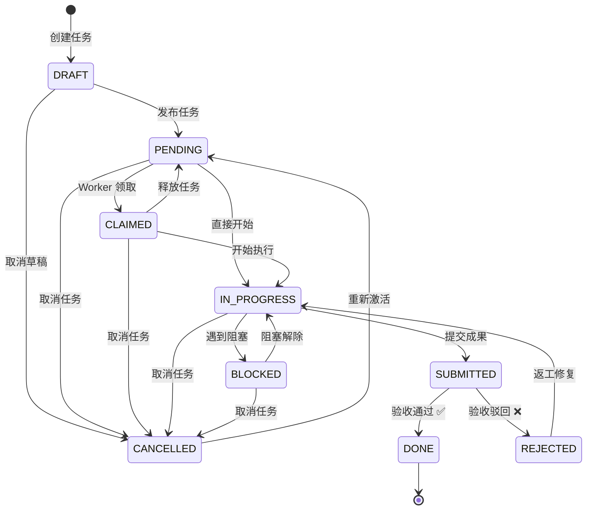

# 数据模型文档

> **源文件**：`src/cli_anything/core/models.py`（约 215 行）
>
> 本文档详细描述 CLI-Anything 项目的数据模型模块，涵盖所有枚举类型、数据类、状态机规则及工具函数。

---

## 目录

1. [模块概述](#1-模块概述)
2. [枚举类型](#2-枚举类型)
3. [状态机转换表 VALID_TRANSITIONS](#3-状态机转换表-valid_transitions)
4. [Task 数据类](#4-task-数据类)
5. [TaskLog 数据类](#5-tasklog-数据类)
6. [Terminal 数据类](#6-terminal-数据类)
7. [工具函数](#7-工具函数)
8. [设计要点](#8-设计要点)
9. [使用示例](#9-使用示例)
10. [模块间关联](#10-模块间关联)

---

## 1. 模块概述

`models.py` 是 CLI-Anything 系统的**类型基础层**，定义了系统运行所需的全部数据类型和枚举。整个项目的其他模块（数据库层、命令层、服务层）均依赖此模块提供的类型定义。

模块职责：

| 职责 | 说明 |
|------|------|
| **枚举定义** | 定义 `TaskType`、`TaskStatus`、`TestStatus`、`ReviewStatus`、`TerminalRole` 五种枚举 |
| **状态机规则** | 通过 `VALID_TRANSITIONS` 字典定义任务状态的合法流转路径 |
| **数据类** | 定义 `Task`（任务）、`TaskLog`（操作日志）、`Terminal`（终端）三种核心数据类 |
| **序列化/反序列化** | 每个数据类提供 `to_dict()` 和 `from_row()` 方法，用于与 SQLite 数据库交互 |
| **工具函数** | 提供 `_now_iso()` 和 `_new_id()` 两个内部辅助函数 |

依赖关系：

```
models.py
├── json          — tags / test_report 的 JSON 序列化
├── uuid          — 生成短 UUID
├── dataclasses   — @dataclass 装饰器
├── datetime      — ISO8601 时间戳
└── enum          — 枚举基类
```

---

## 2. 枚举类型

所有枚举均继承 `(str, Enum)`，因此枚举值本身就是字符串，可直接用于 JSON 序列化和数据库存储。

### 2.1 TaskType — 任务类型

```python
class TaskType(str, Enum):
    MASTER  = "master"    # 主任务
    SUBTASK = "subtask"   # 子任务
    REVIEW  = "review"    # 双盲审查任务（Judgment Day）
```

| 成员 | 值 | 说明 |
|------|----|------|
| `MASTER` | `"master"` | 主任务，可以包含子任务 |
| `SUBTASK` | `"subtask"` | 子任务，隶属于某个主任务，通过 `parent_id` 关联 |
| `REVIEW` | `"review"` | 双盲对抗审查任务（Judgment Day）。由 `trigger_judgment_day()` 自动创建，不应手动创建。通过 `parent_id` 关联被审查的原始任务；裁决结果存储在 `test_report` 字段；`tags` 包含 `jd-judge-a`/`jd-judge-b` 和 `jd-round-N` 标签 |

### 2.2 TaskStatus — 任务状态（9 种）

```python
class TaskStatus(str, Enum):
    DRAFT       = "draft"
    PENDING     = "pending"
    CLAIMED     = "claimed"
    IN_PROGRESS = "in_progress"
    SUBMITTED   = "submitted"
    DONE        = "done"
    REJECTED    = "rejected"
    BLOCKED     = "blocked"
    CANCELLED   = "cancelled"
```

| 成员 | 值 | 说明 |
|------|----|------|
| `DRAFT` | `"draft"` | 草稿状态，任务刚创建尚未正式发布，待审阅确认 |
| `PENDING` | `"pending"` | 待处理，任务已发布，等待 Worker 终端领取 |
| `CLAIMED` | `"claimed"` | 已领取，某个 Worker 终端已声明负责该任务 |
| `IN_PROGRESS` | `"in_progress"` | 进行中，Worker 正在执行任务 |
| `SUBMITTED` | `"submitted"` | 已提交，Worker 完成工作并提交等待验收 |
| `DONE` | `"done"` | 已完成，任务通过验收，**终态** |
| `REJECTED` | `"rejected"` | 已驳回，验收未通过，需返工 |
| `BLOCKED` | `"blocked"` | 已阻塞，因依赖或外部原因无法继续 |
| `CANCELLED` | `"cancelled"` | 已取消，任务被废弃（可重新激活） |

### 2.3 TestStatus — 测试状态（4 种）

```python
class TestStatus(str, Enum):
    NOT_RUN = "not_run"
    RUNNING = "running"
    PASSED  = "passed"
    FAILED  = "failed"
```

| 成员 | 值 | 说明 |
|------|----|------|
| `NOT_RUN` | `"not_run"` | 尚未运行测试 |
| `RUNNING` | `"running"` | 测试正在执行中 |
| `PASSED` | `"passed"` | 测试全部通过 |
| `FAILED` | `"failed"` | 测试存在失败项 |

### 2.4 ReviewStatus — 审阅状态（4 种）

```python
class ReviewStatus(str, Enum):
    NOT_REQUIRED = "not_required"
    PENDING      = "pending_review"
    APPROVED     = "approved"
    REJECTED     = "rejected"
```

| 成员 | 值 | 说明 |
|------|----|------|
| `NOT_REQUIRED` | `"not_required"` | 该任务不需要代码审阅 |
| `PENDING` | `"pending_review"` | 待审阅，等待审阅者处理 |
| `APPROVED` | `"approved"` | 审阅已通过 |
| `REJECTED` | `"rejected"` | 审阅未通过，需修改 |

> **注意**：`ReviewStatus.PENDING` 的值是 `"pending_review"`（而非 `"pending"`），与 `TaskStatus.PENDING` 区分开，避免在数据库层产生歧义。

### 2.5 TerminalRole — 终端角色

```python
class TerminalRole(str, Enum):
    MASTER = "master"
    WORKER = "worker"
```

| 成员 | 值 | 说明 |
|------|----|------|
| `MASTER` | `"master"` | 主控终端，负责任务分发、验收和全局管理 |
| `WORKER` | `"worker"` | 工作终端，负责领取并执行任务 |

---

## 3. 状态机转换表 VALID_TRANSITIONS

### 3.1 转换规则定义

```python
VALID_TRANSITIONS: dict[TaskStatus, set[TaskStatus]] = {
    TaskStatus.DRAFT:       {TaskStatus.PENDING, TaskStatus.CANCELLED},
    TaskStatus.PENDING:     {TaskStatus.CLAIMED, TaskStatus.IN_PROGRESS, TaskStatus.CANCELLED},
    TaskStatus.CLAIMED:     {TaskStatus.IN_PROGRESS, TaskStatus.PENDING, TaskStatus.CANCELLED},
    TaskStatus.IN_PROGRESS: {TaskStatus.SUBMITTED, TaskStatus.BLOCKED, TaskStatus.CANCELLED},
    TaskStatus.SUBMITTED:   {TaskStatus.DONE, TaskStatus.REJECTED},
    TaskStatus.REJECTED:    {TaskStatus.IN_PROGRESS},
    TaskStatus.BLOCKED:     {TaskStatus.IN_PROGRESS, TaskStatus.CANCELLED},
    TaskStatus.DONE:        set(),           # 终态，不可转换
    TaskStatus.CANCELLED:   {TaskStatus.PENDING},  # 可重新激活
}
```

### 3.2 转换矩阵

下表中 `✓` 表示允许的转换，`-` 表示不允许：

| 从 ＼ 到 | DRAFT | PENDING | CLAIMED | IN_PROGRESS | SUBMITTED | DONE | REJECTED | BLOCKED | CANCELLED |
|----------|:-----:|:-------:|:-------:|:-----------:|:---------:|:----:|:--------:|:-------:|:---------:|
| **DRAFT** | - | ✓ | - | - | - | - | - | - | ✓ |
| **PENDING** | - | - | ✓ | ✓ | - | - | - | - | ✓ |
| **CLAIMED** | - | ✓ | - | ✓ | - | - | - | - | ✓ |
| **IN_PROGRESS** | - | - | - | - | ✓ | - | - | ✓ | ✓ |
| **SUBMITTED** | - | - | - | - | - | ✓ | ✓ | - | - |
| **REJECTED** | - | - | - | ✓ | - | - | - | - | - |
| **BLOCKED** | - | - | - | ✓ | - | - | - | - | ✓ |
| **DONE** | - | - | - | - | - | - | - | - | - |
| **CANCELLED** | - | ✓ | - | - | - | - | - | - | - |

### 3.3 状态流转图（Mermaid）



### 3.4 ASCII 状态流转图

```
                          ┌──────────────────────────────────┐
                          │            CANCELLED             │
                          │         （已取消，可重激活）        │
                          └──────┬───────────────────────────┘
                                 │ 重新激活
            ┌────────────────────▼──────────────────────┐
            │                                           │
     ┌──────┴──────┐      领取       ┌─────────┐       │
     │   PENDING   ├───────────────►│ CLAIMED  │       │
     │  （待处理）   │◄───────────────┤（已领取） │       │
     └──┬───┬──────┘    释放任务     └────┬──┬──┘       │
        │   │                             │  │          │
  取消  │   │ 直接开始         开始执行    │  │ 取消     │
        │   │                             │  │          │
        │   │    ┌────────────────────────┘  │          │
        │   │    │                           │          │
        │   └────┼───►┌─────────────┐       │          │
        │        └───►│ IN_PROGRESS │◄──┐   │          │
        │             │  （进行中）    │   │   │          │
        │             └──┬──┬──┬────┘   │   │          │
        │                │  │  │        │返工│          │
        │         提交   │  │  │阻塞    │   │          │
        │                │  │  │        │   │          │
        │     ┌──────────┘  │  └──►┌────┴───┘          │
        │     ▼             │      │ BLOCKED           │
        │  ┌──────────┐    取消    │（已阻塞）           │
        │  │SUBMITTED │     │      └──────┬────────────┘
        │  │（已提交）  │     │             │  取消
        │  └──┬───┬───┘     │             │
        │     │   │         │             │
        │ 通过│   │驳回      │             │
        │     ▼   ▼         ▼             ▼
        │  ┌────┐ ┌────────┐
        │  │DONE│ │REJECTED│
        │  │终态│ │（已驳回）│
        │  └────┘ └────────┘
        │
  ┌─────▼──────┐
  │  DRAFT     │ ◄── [*] 创建任务
  │ （草稿）    ├──────► PENDING（发布）
  └─────┬──────┘
        │ 取消
        └──────────► CANCELLED
```

### 3.5 关键路径说明

- **正常流程（Happy Path）**：`DRAFT → PENDING → CLAIMED → IN_PROGRESS → SUBMITTED → DONE`
- **驳回返工**：`SUBMITTED → REJECTED → IN_PROGRESS → SUBMITTED → DONE`
- **阻塞恢复**：`IN_PROGRESS → BLOCKED → IN_PROGRESS`
- **取消重激活**：`任意非终态 → CANCELLED → PENDING`
- **终态**：`DONE` 是唯一真正的终态，不可再转换到任何状态
- **伪终态**：`CANCELLED` 看似结束，但允许通过 `→ PENDING` 重新激活

---

## 4. Task 数据类

`Task` 是系统中最核心的数据类，使用 `@dataclass` 装饰器定义，包含 **24 个字段**。

### 4.1 完整字段定义

```python
@dataclass
class Task:
    id: str = field(default_factory=_new_id)
    title: str = ""
    description: str = ""
    status: TaskStatus = TaskStatus.PENDING
    task_type: TaskType = TaskType.MASTER
    priority: int = 3
    tags: list[str] = field(default_factory=list)
    parent_id: Optional[str] = None
    created_by: str = ""
    claimed_by: Optional[str] = None
    claimed_at: Optional[str] = None
    submitted_at: Optional[str] = None
    verified_by: Optional[str] = None
    verified_at: Optional[str] = None
    verify_comment: str = ""
    test_status: TestStatus = TestStatus.NOT_RUN
    test_report: dict = field(default_factory=dict)
    test_path: str = ""
    work_dir: str = ""
    reviewer: Optional[str] = None
    review_status: ReviewStatus = ReviewStatus.NOT_REQUIRED
    review_comment: str = ""
    created_at: str = field(default_factory=_now_iso)
    updated_at: str = field(default_factory=_now_iso)
```

### 4.2 字段详细说明

#### 基本信息

| 字段 | 类型 | 默认值 | 说明 |
|------|------|--------|------|
| `id` | `str` | `_new_id()` | 短 UUID（前 8 位十六进制），自动生成，如 `"a1b2c3d4"` |
| `title` | `str` | `""` | 任务标题，简短描述任务目标 |
| `description` | `str` | `""` | 任务详细描述，可包含实现要求、验收标准等 |

#### 状态与分类

| 字段 | 类型 | 默认值 | 说明 |
|------|------|--------|------|
| `status` | `TaskStatus` | `PENDING` | 当前任务状态，参见 [TaskStatus 枚举](#22-taskstatus--任务状态9-种) |
| `task_type` | `TaskType` | `MASTER` | 任务类型：主任务或子任务 |
| `priority` | `int` | `3` | 优先级 1~5（**1 为最高**，5 为最低），默认中等优先级 |
| `tags` | `list[str]` | `[]` | 标签列表，在数据库中以 JSON 字符串形式存储 |

#### 任务关系

| 字段 | 类型 | 默认值 | 说明 |
|------|------|--------|------|
| `parent_id` | `Optional[str]` | `None` | 父任务 ID，仅当 `task_type == SUBTASK` 时有意义 |

#### 人员与终端

| 字段 | 类型 | 默认值 | 说明 |
|------|------|--------|------|
| `created_by` | `str` | `""` | 创建者的终端 ID |
| `claimed_by` | `Optional[str]` | `None` | 领取该任务的 Worker 终端 ID |
| `verified_by` | `Optional[str]` | `None` | 验收该任务的终端 ID（通常是 Master） |
| `reviewer` | `Optional[str]` | `None` | 代码审阅者的终端 ID |

#### 时间戳

| 字段 | 类型 | 默认值 | 说明 |
|------|------|--------|------|
| `claimed_at` | `Optional[str]` | `None` | 任务被领取的时间，ISO8601 格式 |
| `submitted_at` | `Optional[str]` | `None` | 任务被提交的时间，ISO8601 格式 |
| `verified_at` | `Optional[str]` | `None` | 任务被验收的时间，ISO8601 格式 |
| `created_at` | `str` | `_now_iso()` | 任务创建时间，ISO8601 格式，自动生成 |
| `updated_at` | `str` | `_now_iso()` | 最后更新时间，ISO8601 格式，自动生成 |

#### 验收与审阅

| 字段 | 类型 | 默认值 | 说明 |
|------|------|--------|------|
| `verify_comment` | `str` | `""` | 验收意见，验收通过或驳回时填写 |
| `review_status` | `ReviewStatus` | `NOT_REQUIRED` | 审阅状态，参见 [ReviewStatus 枚举](#24-reviewstatus--审阅状态4-种) |
| `review_comment` | `str` | `""` | 审阅意见 |

#### 测试相关

| 字段 | 类型 | 默认值 | 说明 |
|------|------|--------|------|
| `test_status` | `TestStatus` | `NOT_RUN` | 测试运行状态 |
| `test_report` | `dict` | `{}` | 测试报告数据，在数据库中以 JSON 字符串形式存储 |
| `test_path` | `str` | `""` | 测试文件路径，指向关联的测试脚本 |

#### 工作环境

| 字段 | 类型 | 默认值 | 说明 |
|------|------|--------|------|
| `work_dir` | `str` | `""` | 工作目录路径，Worker 在该目录下执行任务 |

### 4.3 方法说明

#### `to_dict() → dict`

将 Task 实例序列化为字典，用于写入 SQLite 数据库。

**序列化规则**：

| 字段类型 | 序列化方式 |
|----------|-----------|
| 枚举（`TaskStatus`、`TaskType`、`TestStatus`、`ReviewStatus`） | 取 `.value` 属性，转为字符串 |
| `list[str]`（`tags`） | `json.dumps(tags, ensure_ascii=False)` |
| `dict`（`test_report`） | `json.dumps(test_report, ensure_ascii=False)` |
| 其他字段 | 由 `dataclasses.asdict()` 自动处理 |

**实现逻辑**：

```python
def to_dict(self) -> dict:
    d = asdict(self)
    d["status"] = self.status.value
    d["task_type"] = self.task_type.value
    d["test_status"] = self.test_status.value
    d["review_status"] = self.review_status.value
    d["tags"] = json.dumps(self.tags, ensure_ascii=False)
    d["test_report"] = json.dumps(self.test_report, ensure_ascii=False)
    return d
```

> **注意**：`ensure_ascii=False` 确保中文标签不会被转义为 `\uXXXX`。

#### `from_row(row: dict) → Task`（类方法）

从数据库查询结果的字典行创建 Task 实例。

**反序列化规则**：

| 字段类型 | 反序列化方式 |
|----------|-------------|
| 枚举 | 用对应枚举类构造，如 `TaskStatus(row["status"])` |
| `tags` | `json.loads(row.get("tags", "[]"))` |
| `test_report` | `json.loads(row.get("test_report", "{}"))` |
| 可选字段 | 使用 `row.get(key, default)` 提供安全默认值 |

**健壮性设计**：

- 所有可选字段都使用 `row.get()` 而非 `row[]`，避免键缺失时抛出 `KeyError`
- 对枚举字段提供兜底默认值（如 `"not_run"`、`"not_required"`）
- 仅 `id` 和 `title`（以及 `task_id`、`status` 等关键字段）使用 `row["key"]` 直接访问，缺失时将立即报错（这是预期行为）

#### `can_transition_to(new_status: TaskStatus) → bool`

检查从当前状态到目标状态的流转是否合法。

```python
def can_transition_to(self, new_status: TaskStatus) -> bool:
    return new_status in VALID_TRANSITIONS.get(self.status, set())
```

**使用示例**：

```python
task = Task(status=TaskStatus.IN_PROGRESS)
task.can_transition_to(TaskStatus.SUBMITTED)   # True  — 允许提交
task.can_transition_to(TaskStatus.DONE)         # False — 不能跳过验收直接完成
task.can_transition_to(TaskStatus.BLOCKED)      # True  — 允许阻塞
```

---

## 5. TaskLog 数据类

`TaskLog` 记录任务的每一次操作变更，用于审计跟踪和历史回溯。

### 5.1 字段定义

```python
@dataclass
class TaskLog:
    id: Optional[int] = None
    task_id: str = ""
    action: str = ""
    terminal_id: str = ""
    old_value: str = ""
    new_value: str = ""
    detail: str = ""
    timestamp: str = field(default_factory=_now_iso)
```

| 字段 | 类型 | 默认值 | 说明 |
|------|------|--------|------|
| `id` | `Optional[int]` | `None` | 日志 ID，SQLite 自增主键，创建时不需要手动指定 |
| `task_id` | `str` | `""` | 关联的任务 ID |
| `action` | `str` | `""` | 操作类型，如 `"status_change"`、`"claim"`、`"submit"` 等 |
| `terminal_id` | `str` | `""` | 执行操作的终端 ID |
| `old_value` | `str` | `""` | 变更前的值 |
| `new_value` | `str` | `""` | 变更后的值 |
| `detail` | `str` | `""` | 附加说明或详细信息 |
| `timestamp` | `str` | `_now_iso()` | 操作时间，ISO8601 格式，自动生成 |

### 5.2 方法说明

#### `to_dict() → dict`

```python
def to_dict(self) -> dict:
    d = asdict(self)
    if d["id"] is None:
        del d["id"]  # 自增字段不需要手动设置
    return d
```

- 使用 `dataclasses.asdict()` 进行基础转换
- 当 `id` 为 `None` 时（即新建日志），从字典中删除 `id` 键，让数据库自增列自动分配

#### `from_row(row: dict) → TaskLog`（类方法）

从数据库行字典反序列化。所有可选字段使用 `row.get()` 安全访问。

---

## 6. Terminal 数据类

`Terminal` 代表系统中注册的终端实例（可以是 PowerShell、CMD、WSL、SSH 等）。

### 6.1 字段定义

```python
@dataclass
class Terminal:
    id: str = field(default_factory=_new_id)
    name: str = ""
    role: TerminalRole = TerminalRole.WORKER
    type: str = ""
    pid: int = 0
    last_active: str = field(default_factory=_now_iso)
    registered_at: str = field(default_factory=_now_iso)
```

| 字段 | 类型 | 默认值 | 说明 |
|------|------|--------|------|
| `id` | `str` | `_new_id()` | 终端唯一标识，8 位短 UUID |
| `name` | `str` | `""` | 终端显示名称，如 `"Worker-1"`、`"Master-Main"` |
| `role` | `TerminalRole` | `WORKER` | 终端角色：`master`（主控）或 `worker`（工作） |
| `type` | `str` | `""` | 终端类型：`powershell`、`cmd`、`wsl`、`ssh` 等自由文本 |
| `pid` | `int` | `0` | 终端进程 ID，用于进程管理和存活检测 |
| `last_active` | `str` | `_now_iso()` | 最后活跃时间，ISO8601 格式 |
| `registered_at` | `str` | `_now_iso()` | 注册时间，ISO8601 格式 |

### 6.2 方法说明

#### `to_dict() → dict`

```python
def to_dict(self) -> dict:
    d = asdict(self)
    d["role"] = self.role.value
    return d
```

仅需要额外处理 `role` 枚举，将其转为字符串值。

#### `from_row(row: dict) → Terminal`（类方法）

从数据库行字典反序列化。`role` 字段使用 `TerminalRole(row.get("role", "worker"))` 构造，缺失时默认为 `WORKER`。

---

## 7. 工具函数

模块提供两个以下划线开头的内部辅助函数，供数据类的 `default_factory` 使用。

### 7.1 `_now_iso() → str`

```python
def _now_iso() -> str:
    """返回当前时间的 ISO8601 字符串"""
    return datetime.now().isoformat(timespec="seconds")
```

- **返回格式**：`"2025-01-15T14:30:00"`（精确到秒，不包含微秒）
- **时区**：使用本地时间（`datetime.now()`），不包含时区信息
- **用途**：`Task.created_at`、`Task.updated_at`、`TaskLog.timestamp`、`Terminal.last_active`、`Terminal.registered_at` 等时间字段的默认值工厂

### 7.2 `_new_id() → str`

```python
def _new_id() -> str:
    """生成短 UUID（前 8 位）"""
    return uuid.uuid4().hex[:8]
```

- **返回格式**：8 位十六进制字符串，如 `"a1b2c3d4"`
- **空间大小**：16^8 = 4,294,967,296（约 43 亿种可能）
- **碰撞概率**：在单用户场景下极低，但在大规模并发场景下可能碰撞
- **用途**：`Task.id` 和 `Terminal.id` 的默认值工厂

---

## 8. 设计要点

### 8.1 枚举继承 `str, Enum`

所有枚举类都采用 `(str, Enum)` 双继承设计，这带来以下好处：

```python
status = TaskStatus.PENDING
print(status)         # "pending"   — 自动转为字符串
print(status.value)   # "pending"   — 显式取值
print(f"{status}")    # "pending"   — f-string 中自动转换
status == "pending"   # True        — 可与字符串直接比较
```

这使得枚举值在 JSON 序列化、数据库存储、日志输出等场景下无需额外转换。

### 8.2 序列化与反序列化策略

| 操作 | 方法 | 处理策略 |
|------|------|----------|
| **写入数据库** | `to_dict()` | 枚举 → `.value`；`list`/`dict` → `json.dumps()` |
| **从数据库读取** | `from_row()` | 字符串 → 枚举构造函数；JSON 字符串 → `json.loads()` |

这种设计使得数据模型与 SQLite 的文本存储完美契合。

### 8.3 ID 策略

- 使用 `uuid4` 的前 8 位十六进制字符（32 位熵）
- 优点：简短易读，便于在终端中显示和复制
- 缺点：碰撞概率高于完整 UUID，但在**单用户、少量任务**的 CLI 场景下完全可接受
- 如需更高唯一性，可扩展为 12 位或完整 32 位

### 8.4 状态机设计

- 使用 `dict[TaskStatus, set[TaskStatus]]` 表示合法转换，**简洁且声明式**
- `can_transition_to()` 方法将状态机校验能力直接嵌入 `Task` 数据类
- 转换表是**可扩展的**：新增状态只需在字典中添加条目
- 终态（`DONE`）映射到空集合 `set()`，语义清晰

### 8.5 时间格式统一

所有时间字段统一使用 ISO8601 格式（精确到秒），保证：

- 可排序（字符串字典序等价于时间序）
- 人类可读
- 跨平台兼容

### 8.6 `Optional` 字段的语义

- `Optional[str] = None` 表示该字段"尚未赋值"或"不适用"
- 例如 `claimed_by = None` 意味着任务尚未被任何终端领取
- 与空字符串 `""` 的语义不同：`""` 表示"有值但为空"，`None` 表示"无值"

---

## 9. 使用示例

以下示例演示数据模型在实际业务场景中的典型用法。

### 9.1 创建任务（完整生命周期）

```python
from cli_anything.core.models import (
    Task, TaskType, TaskStatus, TestStatus, ReviewStatus,
    TaskLog, Terminal, TerminalRole
)

# ① 创建一个主任务
task = Task(
    title="实现用户登录接口",
    description="使用 JWT 实现 /api/login 端点，需包含单元测试",
    priority=1,
    tags=["backend", "auth", "urgent"],
    created_by="master01",
)

print(task.id)          # "a1b2c3d4"（自动生成的 8 位短 UUID）
print(task.status)      # TaskStatus.PENDING
print(task.created_at)  # "2025-07-18T10:30:00"
```

### 9.2 创建子任务

```python
# ② 为主任务创建子任务
subtask = Task(
    title="编写 JWT token 生成工具函数",
    description="在 utils/jwt.py 中实现 generate_token() 和 verify_token()",
    task_type=TaskType.SUBTASK,
    parent_id=task.id,              # 关联父任务
    priority=2,
    tags=["backend", "auth"],
    created_by="master01",
)

print(subtask.task_type)   # TaskType.SUBTASK
print(subtask.parent_id)   # "a1b2c3d4"（与父任务 ID 一致）
```

### 9.3 任务状态流转

```python
# ③ Worker 领取任务
print(task.can_transition_to(TaskStatus.CLAIMED))  # True
task.status = TaskStatus.CLAIMED
task.claimed_by = "worker01"
task.claimed_at = "2025-07-18T10:35:00"

# ④ 开始执行
print(task.can_transition_to(TaskStatus.IN_PROGRESS))  # True
task.status = TaskStatus.IN_PROGRESS

# ⑤ 提交成果
print(task.can_transition_to(TaskStatus.SUBMITTED))  # True
task.status = TaskStatus.SUBMITTED
task.submitted_at = "2025-07-18T12:00:00"

# ⑥ 验收通过
print(task.can_transition_to(TaskStatus.DONE))  # True
task.status = TaskStatus.DONE
task.verified_by = "master01"
task.verified_at = "2025-07-18T12:30:00"
task.verify_comment = "代码质量良好，测试覆盖率达标"

# ⑦ 终态无法再转换
print(task.can_transition_to(TaskStatus.PENDING))  # False — DONE 是终态
```

### 9.4 非法状态流转检查

```python
task = Task(status=TaskStatus.PENDING)

# 不能从 PENDING 直接跳到 DONE
print(task.can_transition_to(TaskStatus.DONE))       # False

# 不能从 PENDING 直接跳到 SUBMITTED
print(task.can_transition_to(TaskStatus.SUBMITTED))   # False

# 只能转到 CLAIMED、IN_PROGRESS 或 CANCELLED
print(task.can_transition_to(TaskStatus.CLAIMED))     # True
print(task.can_transition_to(TaskStatus.IN_PROGRESS)) # True
print(task.can_transition_to(TaskStatus.CANCELLED))   # True
```

### 9.5 驳回返工场景

```python
# 任务被提交后验收不通过
task = Task(status=TaskStatus.SUBMITTED)
task.status = TaskStatus.REJECTED  # 验收驳回

# 驳回后只能返工
print(task.can_transition_to(TaskStatus.IN_PROGRESS))  # True
print(task.can_transition_to(TaskStatus.CANCELLED))    # False — 驳回后不能取消

# 返工后重新提交
task.status = TaskStatus.IN_PROGRESS
task.status = TaskStatus.SUBMITTED
task.status = TaskStatus.DONE  # 第二次验收通过
```

### 9.6 序列化与反序列化（数据库交互）

```python
# ===== 写入数据库 =====
task = Task(
    title="重构配置模块",
    tags=["refactor", "config"],
    test_report={"total": 10, "passed": 8, "failed": 2},
)

row = task.to_dict()
print(row["status"])       # "pending"           — 枚举已转为字符串
print(row["tags"])         # '["refactor", "config"]'  — list 已转为 JSON 字符串
print(row["test_report"])  # '{"total": 10, "passed": 8, "failed": 2}'
print(type(row["tags"]))   # <class 'str'>

# 此时 row 可直接用于 SQLite INSERT 语句


# ===== 从数据库读取 =====
db_row = {
    "id": "abcd1234",
    "title": "重构配置模块",
    "description": "",
    "status": "pending",
    "task_type": "master",
    "priority": 3,
    "tags": '["refactor", "config"]',
    "parent_id": None,
    "created_by": "master01",
    "claimed_by": None,
    "claimed_at": None,
    "submitted_at": None,
    "verified_by": None,
    "verified_at": None,
    "verify_comment": "",
    "test_status": "not_run",
    "test_report": '{"total": 10, "passed": 8, "failed": 2}',
    "test_path": "",
    "work_dir": "",
    "reviewer": None,
    "review_status": "not_required",
    "review_comment": "",
    "created_at": "2025-07-18T10:00:00",
    "updated_at": "2025-07-18T10:00:00",
}

restored_task = Task.from_row(db_row)
print(restored_task.status)       # TaskStatus.PENDING  — 字符串已还原为枚举
print(restored_task.tags)         # ["refactor", "config"]  — JSON 已还原为 list
print(restored_task.test_report)  # {"total": 10, "passed": 8, "failed": 2}  — JSON 已还原为 dict
print(type(restored_task.tags))   # <class 'list'>
```

### 9.7 TaskLog 操作日志记录

```python
# 记录一次状态变更日志
log = TaskLog(
    task_id="abcd1234",
    action="status_change",
    terminal_id="worker01",
    old_value="pending",
    new_value="claimed",
    detail="Worker-1 领取了任务",
)

log_dict = log.to_dict()
print(log_dict)
# {
#     'task_id': 'abcd1234',
#     'action': 'status_change',
#     'terminal_id': 'worker01',
#     'old_value': 'pending',
#     'new_value': 'claimed',
#     'detail': 'Worker-1 领取了任务',
#     'timestamp': '2025-07-18T10:35:00'
# }
# 注意：id 字段因为是 None，已被自动删除（让数据库自增）


# 从数据库读取日志
db_log_row = {
    "id": 42,
    "task_id": "abcd1234",
    "action": "status_change",
    "terminal_id": "worker01",
    "old_value": "pending",
    "new_value": "claimed",
    "detail": "Worker-1 领取了任务",
    "timestamp": "2025-07-18T10:35:00",
}
restored_log = TaskLog.from_row(db_log_row)
print(restored_log.id)    # 42 — 从数据库读回了自增 ID
```

### 9.8 Terminal 终端注册

```python
# 注册一个 Master 终端
master_terminal = Terminal(
    name="Master-Main",
    role=TerminalRole.MASTER,
    type="powershell",
    pid=12345,
)

print(master_terminal.id)            # "e5f6a7b8"（自动生成）
print(master_terminal.role)          # TerminalRole.MASTER
print(master_terminal.registered_at) # "2025-07-18T10:00:00"

# 注册一个 Worker 终端
worker_terminal = Terminal(
    name="Worker-1",
    role=TerminalRole.WORKER,
    type="wsl",
    pid=67890,
)

# 序列化
term_dict = master_terminal.to_dict()
print(term_dict["role"])  # "master" — 枚举已转为字符串

# 反序列化
db_term_row = {
    "id": "e5f6a7b8",
    "name": "Master-Main",
    "role": "master",
    "type": "powershell",
    "pid": 12345,
    "last_active": "2025-07-18T10:00:00",
    "registered_at": "2025-07-18T10:00:00",
}
restored_terminal = Terminal.from_row(db_term_row)
print(restored_terminal.role)  # TerminalRole.MASTER — 字符串已还原为枚举
```

### 9.9 枚举的字符串特性

```python
# 因为枚举继承了 str，可以直接当字符串使用
status = TaskStatus.IN_PROGRESS

# 与字符串比较
assert status == "in_progress"          # True

# 在 f-string 中使用
print(f"当前状态: {status}")             # "当前状态: in_progress"

# 作为字典键
status_labels = {
    TaskStatus.PENDING: "⏳ 待处理",
    TaskStatus.IN_PROGRESS: "🔧 进行中",
    TaskStatus.DONE: "✅ 已完成",
}
print(status_labels[status])             # "🔧 进行中"

# JSON 序列化无需额外处理
import json
print(json.dumps({"status": status}))    # '{"status": "in_progress"}'
```

### 9.10 from_row 的容错能力

```python
# from_row 可以处理字段缺失的情况（数据库迁移或旧版数据）
incomplete_row = {
    "id": "abcd1234",
    "title": "旧版本任务",
    "status": "pending",
    "task_type": "master",
    # 其他字段全部缺失
}

task = Task.from_row(incomplete_row)
print(task.priority)       # 3          — 使用默认值
print(task.tags)           # []         — JSON 解析 "[]"
print(task.test_status)    # TestStatus.NOT_RUN — 使用兜底默认值
print(task.review_status)  # ReviewStatus.NOT_REQUIRED
print(task.claimed_by)     # None
```

---

## 10. 模块间关联

`models.py` 是整个 CLI-Anything 系统的**类型基础**，几乎所有功能模块都依赖它。下面按依赖关系分层说明。

### 10.1 依赖关系全景图

```
                        ┌──────────────────────────┐
                        │    models.py (类型基础)    │
                        │ Task / TaskLog / Terminal │
                        │ 枚举 / VALID_TRANSITIONS  │
                        └────────┬─────────────────┘
                                 │
            ┌────────────────────┼────────────────────────┐
            │                    │                        │
     ┌──────▼──────┐    ┌───────▼────────┐    ┌──────────▼─────────┐
     │  storage/   │    │     core/      │    │   utils/           │
     │ database.py │    │ task_manager   │    │ export_import.py   │
     │ (持久化层)   │    │ terminal_mgr   │    │ (导入导出)          │
     │             │    │ health_checker │    │                    │
     └──────┬──────┘    └───────┬────────┘    └────────────────────┘
            │                   │
            │    ┌──────────────┼──────────────────┐
            │    │              │                  │
     ┌──────▼────▼──┐   ┌──────▼──────┐   ┌──────▼──────┐
     │   cli.py     │   │  tui/app.py │   │  web/       │
     │  (命令行)     │   │ (终端 UI)    │   │ dashboard   │
     └──────────────┘   └─────────────┘   └─────────────┘
                                                │
                                         ┌──────▼──────┐
                                         │ mcp_server/ │
                                         │ (AI Agent)  │
                                         └─────────────┘
```

### 10.2 各模块依赖详情

#### 核心层（`core/`）

| 模块 | 引用的类型 | 用途 |
|------|-----------|------|
| **`task_manager.py`** | `Task`, `TaskLog`, `Terminal`, `TaskStatus`, `TaskType`, `TestStatus`, `ReviewStatus`, `TerminalRole`, `VALID_TRANSITIONS`, `_new_id`, `_now_iso` | **最重度依赖者**。管理任务的全生命周期：创建、更新、状态流转校验、操作日志记录和终端管理。直接使用 `VALID_TRANSITIONS` 进行状态机校验，使用 `_new_id` 和 `_now_iso` 生成标识和时间戳 |
| **`terminal_manager.py`** | `Terminal`, `TerminalRole`, `_now_iso` | 终端管理模块，负责终端注册、角色分配和活跃状态追踪。创建并维护 `Terminal` 对象实例 |
| **`health_checker.py`** | `Terminal`, `TaskStatus`, `_now_iso` | 终端健康检测和断线重连模块。检查终端存活状态并更新 `Terminal` 的活跃时间，在函数内按需导入 `TaskStatus` |

#### 持久化层（`storage/`）

| 模块 | 引用的类型 | 用途 |
|------|-----------|------|
| **`database.py`** | `Task`, `TaskLog`, `Terminal` | 数据库 CRUD 层。使用 `to_dict()` 将模型对象转为字典写入 SQLite，使用 `from_row()` 将查询结果转回模型对象 |

**交互流程示例**：

```python
# task_manager.py 创建任务
task = Task(title="实现功能X", created_by="master01")

# database.py 写入数据库
row = task.to_dict()    # 模型 → 字典
db.execute("INSERT INTO tasks ...", row)

# database.py 查询时还原
result = db.execute("SELECT * FROM tasks WHERE id=?", [task_id])
task = Task.from_row(dict(result))  # 字典 → 模型
```

#### 用户界面层

| 模块 | 引用的类型 | 用途 |
|------|-----------|------|
| **`cli.py`** | `TaskStatus`, `TaskType`, `TestStatus`, `ReviewStatus`, `TerminalRole` | 命令行入口层。使用枚举类型进行命令参数验证和任务信息格式化显示 |
| **`tui/app.py`** | `TaskStatus`, `TaskType`, `TerminalRole`, `ReviewStatus` | 基于 Textual 的终端用户界面。使用枚举类型渲染任务看板、显示状态图标和标签 |
| **`web/dashboard.py`** | `TaskStatus`, `TaskType`, `ReviewStatus` | FastAPI Web 后端服务。在 REST API 和 WebSocket 实时推送中使用枚举表示任务状态 |

#### AI 集成层

| 模块 | 引用的类型 | 用途 |
|------|-----------|------|
| **`mcp_server/server.py`** | `TaskStatus`, `TaskType`, `TestStatus`, `ReviewStatus` | MCP (Model Context Protocol) 服务器。向 AI Agent 暴露任务管理工具，使用枚举类型规范 Agent 的操作参数 |

#### 工具层

| 模块 | 引用的类型 | 用途 |
|------|-----------|------|
| **`utils/export_import.py`** | `Task`, `TaskLog` | 数据导入导出工具。将任务和日志序列化为 JSON 格式进行备份和恢复 |

#### 测试层

| 模块 | 引用的类型 | 用途 |
|------|-----------|------|
| **`tests/test_task_manager.py`** | `Task`, `TaskStatus`, `TaskType`, `TestStatus`, `ReviewStatus`, `TerminalRole`, `Terminal` | 单元测试。构造测试数据、验证状态流转逻辑、测试序列化/反序列化的正确性 |

### 10.3 数据流向

```
用户操作
  │
  ▼
cli.py / tui/app.py / web/dashboard.py / mcp_server/server.py
  │                                         （使用枚举做参数校验）
  ▼
core/task_manager.py
  │  ① 创建 Task / TaskLog / Terminal 对象
  │  ② 使用 VALID_TRANSITIONS 校验状态流转
  │  ③ 调用 to_dict() 准备写入
  ▼
storage/database.py
  │  ④ 执行 SQL INSERT/UPDATE
  │  ⑤ 查询后调用 from_row() 还原对象
  ▼
返回 Task / TaskLog / Terminal 实例给上层
```

### 10.4 类型流转总结

| 阶段 | 数据形态 | 转换方法 |
|------|----------|----------|
| Python 业务逻辑中 | `Task` / `TaskLog` / `Terminal` 对象 | — |
| 写入 SQLite 前 | `dict`（枚举→字符串，list/dict→JSON 字符串） | `to_dict()` |
| SQLite 存储中 | 纯文本行 | — |
| 从 SQLite 读出后 | `dict`（`sqlite3.Row` → `dict`） | — |
| 还原为 Python 对象 | `Task` / `TaskLog` / `Terminal` 对象 | `from_row()` |
| 导出为 JSON 文件 | JSON 字符串 | `to_dict()` + `json.dumps()` |
| REST API 响应 | JSON 字符串 | `to_dict()` + FastAPI 自动序列化 |
