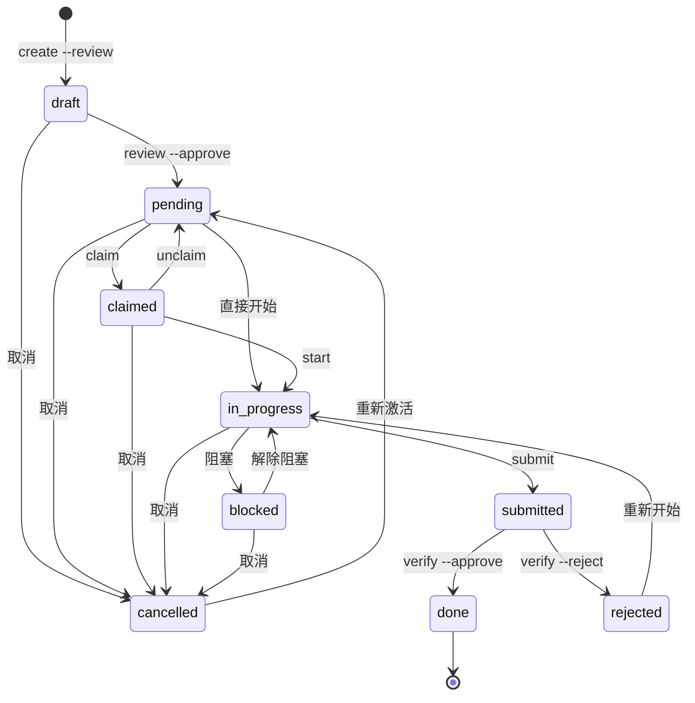
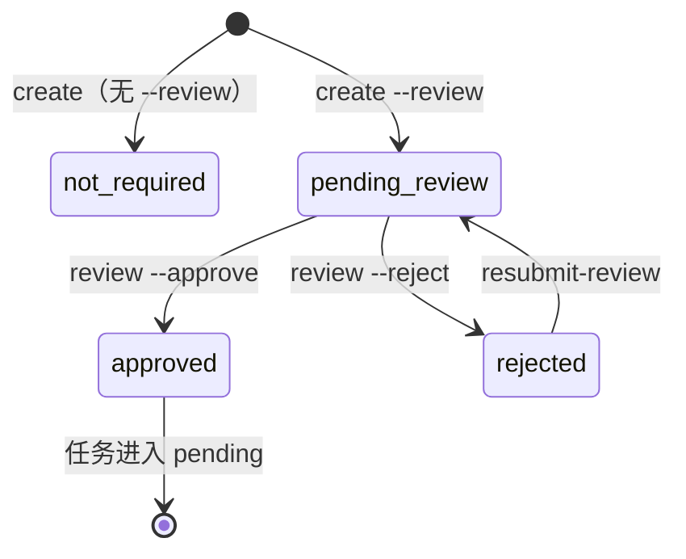

# CLI-Anything — CLI 命令行接口文档

> **源文件**: `src/cli_anything/cli.py`（~750 行）
> **框架**: [Typer](https://typer.tiangolo.com/) + [Rich](https://rich.readthedocs.io/)
> **入口**: `cli-anything` / `task`（注册于 `pyproject.toml`，实际入口函数为 `main()`，先执行 `_resolve_aliases()` 别名预处理，再调用 `app()`）

---

## 目录

- [1. 模块概述](#1-模块概述)
- [2. 全局配置与初始化](#2-全局配置与初始化)
  - [2.1 Typer App 实例](#21-typer-app-实例)
  - [2.2 状态颜色映射 STATUS\_COLORS](#22-状态颜色映射-status_colors)
  - [2.3 优先级标签 PRIORITY\_LABELS](#23-优先级标签-priority_labels)
  - [2.4 审阅状态标签 REVIEW\_STATUS\_LABELS](#24-审阅状态标签-review_status_labels)
- [3. 内部工具函数](#3-内部工具函数)
  - [3.1 \_init()](#31-_init)
  - [3.2 \_get\_tm()](#32-_get_tm)
  - [3.3 \_get\_term\_mgr()](#33-_get_term_mgr)
  - [3.4 \_select\_reviewer()](#34-_select_reviewer)
  - [3.5 \_resolve\_aliases()](#35-_resolve_aliases)
  - [3.6 main()](#36-main)
- [4. 命令详解（全部 24 个命令）](#4-命令详解全部-24-个命令)
  - [4.1 初始化](#41-初始化)
  - [4.2 任务创建与管理](#42-任务创建与管理)
  - [4.3 任务流转](#43-任务流转)
  - [4.4 审阅流程](#44-审阅流程)
  - [4.5 查询与展示](#45-查询与展示)
  - [4.6 测试](#46-测试)
  - [4.7 终端管理](#47-终端管理)
  - [4.8 数据导入导出](#48-数据导入导出)
  - [4.9 高级功能](#49-高级功能)
- [5. 输出格式](#5-输出格式)
- [6. 错误处理](#6-错误处理)
- [7. 状态流转图](#7-状态流转图)
  - [7.1 任务状态流转（Mermaid）](#71-任务状态流转mermaid)
  - [7.2 审阅状态流转（Mermaid）](#72-审阅状态流转mermaid)
  - [7.3 任务状态流转（ASCII）](#73-任务状态流转ascii)
  - [7.4 命令与状态变更对照表](#74-命令与状态变更对照表)
- [8. 设计要点](#8-设计要点)
- [9. 命令速查表](#9-命令速查表)
- [10. 典型使用场景](#10-典型使用场景)
  - [10.1 完整协同工作流（从创建到验收）](#101-完整协同工作流从创建到验收)
  - [10.2 带审阅的任务创建流程](#102-带审阅的任务创建流程)
  - [10.3 Worker 日常工作流](#103-worker-日常工作流)
  - [10.4 数据备份与迁移](#104-数据备份与迁移)
  - [10.5 多终端环境初始化](#105-多终端环境初始化)
  - [10.6 健康检查与故障恢复](#106-健康检查与故障恢复)

---

## 1. 模块概述

`cli.py` 是 CLI-Anything 项目的**命令行入口层**，基于 Typer 框架构建，共注册 **24 个命令**，覆盖任务全生命周期管理、审阅流程、终端管理、数据导入/导出及可视化等功能。

核心职责：

| 职责 | 说明 |
|------|------|
| 参数解析 | 利用 Typer 声明式地定义参数、选项、默认值 |
| 输出格式化 | 通过 Rich Console / Table / Panel 实现彩色美观的终端输出 |
| 业务调度 | 将 CLI 参数转发给 `TaskManager` / `TerminalManager` 执行业务逻辑 |
| 异常处理 | 捕获 `TaskManagerError`，统一输出友好错误信息 |

依赖关系：

```
cli.py
├── core.models        (TaskStatus, TaskType, TestStatus, ReviewStatus, TerminalRole)
├── core.task_manager  (TaskManager, TaskManagerError)
├── core.terminal_manager (TerminalManager)
├── core.test_runner   (run_tests_simple)
├── storage.database   (Database)
└── utils.config       (Config)
```

---

## 2. 全局配置与初始化

### 2.1 Typer App 实例

```python
app = typer.Typer(
    name="cli-anything",
    help="跨终端协同任务系统 — Master/Worker 协同开发",
    no_args_is_help=True,
)
```

- **name**: 程序名称为 `cli-anything`
- **no_args_is_help**: 无参数时自动显示帮助信息

### 2.2 状态颜色映射 STATUS_COLORS

为每个任务状态分配 Rich 颜色，用于在终端输出中区分状态：

| 状态 | 颜色 | 含义 |
|------|------|------|
| `draft` | `bright_yellow` | 草稿（待审阅） |
| `pending` | `yellow` | 待领取 |
| `claimed` | `cyan` | 已领取 |
| `in_progress` | `blue` | 进行中 |
| `submitted` | `magenta` | 已提交 |
| `done` | `green` | 已完成 |
| `rejected` | `red` | 已驳回 |
| `blocked` | `bright_black` | 已阻塞 |
| `cancelled` | `dim` | 已取消 |

### 2.3 优先级标签 PRIORITY_LABELS

为 1-5 的整数优先级分配带 Emoji 的中文标签：

| 优先级 | 标签 |
|--------|------|
| 1 | 🔴 紧急 |
| 2 | 🟠 高 |
| 3 | 🟡 中 |
| 4 | 🟢 低 |
| 5 | ⚪ 最低 |

### 2.4 审阅状态标签 REVIEW_STATUS_LABELS

| ReviewStatus 值 | 显示标签 |
|------------------|----------|
| `not_required` | — |
| `pending_review` | ⏳ 待审阅 |
| `approved` | ✅ 已通过 |
| `rejected` | ❌ 已驳回 |

---

## 3. 内部工具函数

以下函数以 `_` 前缀标记为模块内部使用，不直接暴露给用户。

### 3.1 _init()

```python
def _init():
    """初始化全局组件"""
```

**功能**：懒加载模式初始化全局单例组件。

**初始化顺序**：

1. 创建 `Config` 实例并 `load()` 配置文件
2. 从配置中读取 `database.path`，创建 `Database` 并 `connect()`
3. 创建 `TerminalManager`（依赖 `Database` + `Config`）
4. 创建 `Notifier`（依赖 `Config`，从配置中读取通知开关）
5. 创建 `TaskManager`（依赖 `Database` + 当前终端 ID + `Notifier` 实例注入）

**全局变量**：

| 变量 | 类型 | 说明 |
|------|------|------|
| `_db` | `Database \| None` | 数据库实例 |
| `_config` | `Config \| None` | 配置实例 |
| `_notifier` | `Notifier \| None` | 通知器实例 |
| `_tm` | `TaskManager \| None` | 任务管理器 |
| `_term_mgr` | `TerminalManager \| None` | 终端管理器 |

**防重复初始化**：通过检查 `_db is not None` 避免重复初始化。

### 3.2 _get_tm()

```python
def _get_tm() -> TaskManager:
```

调用 `_init()` 后返回 `TaskManager` 实例。几乎所有命令的入口都先调用此函数获取业务操作对象。

### 3.3 _get_term_mgr()

```python
def _get_term_mgr() -> TerminalManager:
```

调用 `_init()` 后返回 `TerminalManager` 实例。主要被终端管理类命令使用。

### 3.4 _select_reviewer()

```python
def _select_reviewer() -> Optional[str]:
```

**功能**：交互式选择审阅者终端。

**交互流程**：

1. 获取所有已注册终端列表
2. 排除当前终端（不能审阅自己的任务）
3. 以带编号的列表展示候选终端（含角色 Emoji：👑 Master / 🔧 Worker）
4. 通过 `typer.prompt` 让用户输入编号选择
5. 输入 `0` 或无效编号则跳过

**返回值**：选中终端的 ID 字符串，或 `None`（跳过）。

### 3.5 _resolve_aliases()

```python
def _resolve_aliases():
    """从配置文件的 aliases 段解析命令别名"""
```

**功能**：在 Typer 处理命令行参数之前，将用户输入的别名替换为实际命令。

**逻辑流程**：

1. 加载 `Config` 读取 `aliases` 配置段
2. 检查 `sys.argv[1]` 是否匹配某个别名
3. 如果匹配，将别名展开（支持带参数的别名，如 `wip` → `my --status in_progress`）
4. 替换 `sys.argv[1:2]` 为展开后的参数列表

**别名示例**（来自 `config.yaml`）：

| 别名 | 展开为 | 效果 |
|------|--------|------|
| `todo` | `available` | `task todo` → `task available` |
| `wip` | `my --status in_progress` | `task wip` → `task my --status in_progress` |
| `done` | `my --status done` | `task done` → `task my --status done` |

**容错设计**：整个函数包裹在 `try/except` 中，别名解析失败不影响正常命令执行。

### 3.6 main()

```python
def main():
    """程序入口函数（pyproject.toml 注册的实际入口点）"""
```

**功能**：先执行别名预处理，再启动 Typer 应用。

**调用链**：

```
pyproject.toml → main() → _resolve_aliases() → app()
```

**为什么需要 main()**：Typer 的 `app()` 直接处理 `sys.argv`，不支持在命令解析前进行自定义预处理。通过 `main()` 作为中间层，可以在 Typer 解析参数前完成别名替换。

---

## 4. 命令详解（全部 24 个命令）

### 4.1 初始化

#### `init` — 初始化配置与数据库

```bash
task init [--role master|worker] [--name "终端名称"]
```

| 参数 | 类型 | 默认值 | 说明 |
|------|------|--------|------|
| `--role` | `str` | `"worker"` | 终端角色：`master` 或 `worker` |
| `--name` | `str` | `""` | 终端名称 |

**执行流程**：

1. 创建 `Config` 实例，调用 `init_config()` 生成配置文件
2. 加载配置，初始化数据库
3. 创建 `TerminalManager` 并注册当前终端
4. 关闭数据库连接

**输出示例**：

```
✓ 配置文件已创建: /path/to/.cli-anything.toml
✓ 数据库已初始化: /path/to/tasks.db
✓ 终端已注册: T-XXXXXX (worker)
```

> **注意**：这是唯一不经过 `_init()` 而自行完成初始化的命令，因为它负责首次创建配置和数据库。

---

### 4.2 任务创建与管理

#### `create` — 创建新任务

```bash
task create "任务标题" [--desc "描述"] [--priority 1-5] [--tags "前端,API"] [--review] [--reviewer TERMINAL_ID]
```

| 参数 | 短选项 | 类型 | 默认值 | 说明 |
|------|--------|------|--------|------|
| `TITLE` | — | `str` (位置参数) | **必填** | 任务标题 |
| `--desc` | `-d` | `str` | `""` | 任务描述 |
| `--priority` | `-p` | `int` | `3` | 优先级 1-5 |
| `--tags` | `-t` | `str` | `None` | 标签，逗号分隔 |
| `--review` | `-r` | `bool` | `False` | 创建后进入审阅流程 |
| `--reviewer` | — | `str` | `None` | 指定审阅者终端 ID |

**行为逻辑**：

- 若指定 `--review` 但未指定 `--reviewer`，则触发**交互式审阅者选择**
- 有审阅者时：任务状态为 `draft`（待审阅）
- 无审阅者时：任务状态为 `pending`（可直接领取）
- 标签参数以逗号分隔，自动 `strip()` 去除空格

#### `decompose` — 拆解子任务

```bash
task decompose PARENT_ID '[{"title":"子任务1"},{"title":"子任务2","desc":"描述"}]' [--review] [--reviewer ID]
```

| 参数 | 短选项 | 类型 | 默认值 | 说明 |
|------|--------|------|--------|------|
| `PARENT_ID` | — | `str` (位置参数) | **必填** | 父任务 ID |
| `SUBTASKS_JSON` | — | `str` (位置参数) | **必填** | 子任务 JSON 数组 |
| `--review` | `-r` | `bool` | `False` | 子任务创建后发送审阅 |
| `--reviewer` | — | `str` | `None` | 指定审阅者终端 ID |

**JSON 格式**：数组中每个对象至少包含 `title` 字段，可选 `desc` 等字段。

**异常处理**：同时捕获 `json.JSONDecodeError`（JSON 格式错误）和 `TaskManagerError`（业务错误）。

#### `update` — 更新任务属性

```bash
task update TASK_ID [--title "新标题"] [--desc "新描述"] [--priority 2] [--tags "标签"] [--test-path "path"] [--work-dir "dir"]
```

| 参数 | 短选项 | 类型 | 默认值 | 说明 |
|------|--------|------|--------|------|
| `TASK_ID` | — | `str` (位置参数) | **必填** | 任务 ID |
| `--title` | — | `str` | `None` | 新标题 |
| `--desc` | — | `str` | `None` | 新描述 |
| `--priority` | `-p` | `int` | `None` | 新优先级 |
| `--tags` | — | `str` | `None` | 新标签（逗号分隔） |
| `--test-path` | — | `str` | `None` | 测试路径 |
| `--work-dir` | — | `str` | `None` | 工作目录 |

**说明**：所有选项均为可选，只更新传入的字段，未传入的保持原值。

#### `delete` — 删除任务

```bash
task delete TASK_ID [--force]
```

| 参数 | 短选项 | 类型 | 默认值 | 说明 |
|------|--------|------|--------|------|
| `TASK_ID` | — | `str` (位置参数) | **必填** | 任务 ID |
| `--force` | `-f` | `bool` | `False` | 跳过确认提示 |

**安全机制**：默认弹出确认提示 `确认删除任务 XXX (标题)?`，使用 `--force` 可跳过。

---

### 4.3 任务流转

#### `claim` — 领取任务

```bash
task claim TASK_ID
```

**角色**：Worker

**状态变更**：`pending` → `claimed`

**说明**：将当前终端标记为任务的领取者。

#### `unclaim` — 释放任务

```bash
task unclaim TASK_ID
```

**角色**：Worker

**状态变更**：`claimed` → `pending`

**说明**：释放已领取但不再处理的任务，使其回到可领取状态。

#### `start` — 开始任务

```bash
task start TASK_ID
```

**角色**：Worker

**状态变更**：`claimed` → `in_progress`

**说明**：标记任务正式开始工作。

#### `submit` — 提交任务

```bash
task submit TASK_ID [--test/--no-test]
```

| 参数 | 类型 | 默认值 | 说明 |
|------|------|--------|------|
| `TASK_ID` | `str` (位置参数) | **必填** | 任务 ID |
| `--test/--no-test` | `bool` | `True` | 提交前是否运行测试 |

**角色**：Worker

**状态变更**：`in_progress` → `submitted`

**提交前测试流程**：

1. 若 `--test`（默认）且任务配置了 `test_path`，自动运行 `run_tests_simple()`
2. 测试通过 → 继续提交
3. 测试失败 → 弹出确认提示 `测试未通过，仍要提交？`
4. 测试结果自动记录到任务的 `test_status` 和 `test_result` 字段

#### `verify` — 验收任务

```bash
task verify TASK_ID [--approve/--reject] [--comment "验收意见"]
```

| 参数 | 短选项 | 类型 | 默认值 | 说明 |
|------|--------|------|--------|------|
| `TASK_ID` | — | `str` (位置参数) | **必填** | 任务 ID |
| `--approve/--reject` | — | `bool` | `True`（默认通过） | 通过或驳回 |
| `--comment` | `-c` | `str` | `""` | 验收意见 |

**角色**：Master

**状态变更**：
- 通过：`submitted` → `done`
- 驳回：`submitted` → `rejected`

---

### 4.4 审阅流程

审阅流程用于在任务正式进入 `pending` 状态之前，先由指定的审阅者终端对任务定义进行审核。

#### `review` — 审阅任务定义

```bash
task review TASK_ID --approve [--comment "意见"]
task review TASK_ID --reject  [--comment "修改建议"]
```

| 参数 | 短选项 | 类型 | 默认值 | 说明 |
|------|--------|------|--------|------|
| `TASK_ID` | — | `str` (位置参数) | **必填** | 任务 ID |
| `--approve` | `-a` | `bool` | `False` | 通过审阅 |
| `--reject` | — | `bool` | `False` | 驳回审阅 |
| `--comment` | `-c` | `str` | `""` | 审阅意见 |

**校验规则**：

- `--approve` 和 `--reject` 必须指定其一
- 两者不能同时使用

**状态变更**：
- 通过：`draft` → `pending`
- 驳回：标记审阅状态为 `rejected`

#### `resubmit-review` — 重新提交审阅

```bash
task resubmit-review TASK_ID [--reviewer NEW_TERMINAL_ID]
```

| 参数 | 类型 | 默认值 | 说明 |
|------|------|--------|------|
| `TASK_ID` | `str` (位置参数) | **必填** | 任务 ID |
| `--reviewer` | `str` | `None` | 更换审阅者终端 ID |

**交互流程**：

1. 若未指定 `--reviewer`，弹出确认提示 `是否更换审阅者?`
2. 确认更换 → 触发交互式审阅者选择
3. 不更换 → 保留原审阅者

**说明**：用于审阅被驳回后，修改任务内容并重新提交审阅。

---

### 4.5 查询与展示

#### `list` — 列出任务

```bash
task list [--status pending] [--type subtask] [--parent PARENT_ID] [--tag "标签"] [--json]
```

| 参数 | 短选项 | 类型 | 默认值 | 说明 |
|------|--------|------|--------|------|
| `--status` | `-s` | `str` | `None` | 按状态过滤 |
| `--type` | — | `str` | `None` | 按类型过滤：`master` / `subtask` |
| `--parent` | — | `str` | `None` | 按父任务 ID 过滤 |
| `--tag` | — | `str` | `None` | 按标签过滤 |

**输出格式**：Rich Table

| 列名 | 宽度 | 说明 |
|------|------|------|
| ID | 10 | 任务 ID（粗体） |
| 标题 | 30 | 任务标题 |
| 状态 | 12 | 带颜色的状态值 |
| 优先级 | 8 | Emoji + 中文标签 |
| 类型 | 8 | `master` / `subtask` |
| 领取者 | 10 | 终端 ID 或 `—` |

**空结果**：输出灰色提示 `没有匹配的任务`。

#### `show` — 查看任务详情

```bash
task show TASK_ID
```

**输出格式**：Rich Panel（边框颜色随状态变化）

**展示字段**：

- 标题、描述、状态、类型、优先级、标签
- 父任务、创建者、领取者、测试状态
- 审阅状态、审阅者、审阅意见（仅在需要审阅时显示）
- 创建时间、更新时间

**子任务展示**：若该任务有子任务，还会额外显示：

- 进度条：`📊 进度: 3/5 (60%)`
- 子任务列表：带颜色圆点 + 状态

#### `progress` — 查看主任务进度

```bash
task progress PARENT_ID
```

**输出格式**：Rich Panel

**展示内容**：

- 总计 / 完成 / 进度百分比
- 按状态分组的数量分布

#### `log` — 查看操作日志

```bash
task log [TASK_ID] [--limit 20]
```

| 参数 | 短选项 | 类型 | 默认值 | 说明 |
|------|--------|------|--------|------|
| `TASK_ID` | — | `str` (位置参数) | `None`（全部） | 任务 ID，留空显示全部 |
| `--limit` | `-n` | `int` | `20` | 显示条数 |

**输出格式**：Rich Table

| 列名 | 宽度 | 说明 |
|------|------|------|
| 时间 | 19 | 时间戳 |
| 任务 | 10 | 关联任务 ID |
| 操作 | 14 | 操作类型 |
| 终端 | 10 | 执行终端 |
| 详情 | 40 | 操作详情 |

#### `available` — 列出可领取的任务

```bash
task available
```

**角色**：Worker

**说明**：自动筛选状态为 `pending` 且类型为 `subtask` 的任务。

**输出格式**：Rich Table（ID、标题、优先级、父任务）

#### `my` — 查看我领取的任务

```bash
task my
```

**角色**：Worker

**说明**：列出当前终端领取的所有任务（不限状态）。

**输出格式**：Rich Table（ID、标题、状态、测试状态）

---

### 4.6 测试

#### `test` — 运行任务关联的测试

```bash
task test TASK_ID
```

| 参数 | 类型 | 说明 |
|------|------|------|
| `TASK_ID` | `str` (位置参数) | 任务 ID |

**前置校验**：

- 任务必须存在
- 任务必须配置了 `test_path` 字段

**执行流程**：

1. 调用 `run_tests_simple(test_path, work_dir)` 运行 pytest
2. 将测试结果（`TestStatus.PASSED` / `TestStatus.FAILED`）写入任务
3. 输出通过/失败摘要
4. 失败时展示最后 2000 字符的测试输出（Red Panel）

---

### 4.7 终端管理

#### `terminals` — 查看所有注册终端

```bash
task terminals
```

**输出格式**：Rich Table

| 列名 | 宽度 | 说明 |
|------|------|------|
| ID | 10 | 终端 ID |
| 名称 | 15 | 终端名称 |
| 角色 | 8 | 绿色 `master` / 青色 `worker` |
| 类型 | 12 | 终端类型 |
| PID | 8 | 进程 ID |
| 最后活跃 | 19 | 最后活跃时间 |

---

### 4.8 数据导入导出

#### `export` — 导出任务数据

```bash
task export [OUTPUT_PATH] [--parent PARENT_ID] [--no-logs]
```

| 参数 | 类型 | 默认值 | 说明 |
|------|------|--------|------|
| `OUTPUT` | `str` (位置参数) | `tasks_export.json` | 输出文件路径 |
| `--parent` | `str` | `None` | 仅导出指定主任务及其子任务 |
| `--no-logs` | `bool` | `False` | 不导出操作日志 |

**输出**：`✓ 导出完成: X 个任务, Y 条日志 → path`

#### `import` — 导入任务数据

```bash
task import INPUT_FILE [--overwrite]
```

| 参数 | 类型 | 默认值 | 说明 |
|------|------|--------|------|
| `INPUT_FILE` | `str` (位置参数) | **必填** | 输入 JSON 文件路径 |
| `--overwrite` | `bool` | `False` | 已存在的任务是否覆盖 |

**输出**：`✓ 导入完成: X 个任务, Y 个跳过, Z 条日志`

**错误处理**：如有导入错误，逐条以红色输出。

---

### 4.9 高级功能

#### `serve` — 启动 MCP Server

```bash
task serve
```

**说明**：启动 MCP (Model Context Protocol) Server，供 AI Agent 调用任务管理接口。

**依赖**：延迟导入 `cli_anything.mcp_server.server`。

#### `dashboard` — 启动 Web 可视化看板

```bash
task dashboard [--host 127.0.0.1] [--port 8080] [--no-open]
```

| 参数 | 类型 | 默认值 | 说明 |
|------|------|--------|------|
| `--host` | `str` | `127.0.0.1` | 监听地址 |
| `--port` | `int` | `8080` | 监听端口 |
| `--no-open` | `bool` | `False` | 不自动打开浏览器 |

**依赖**：延迟导入 `cli_anything.web.dashboard`。

#### `tui` — 启动 TUI 终端界面

```bash
task tui
```

**说明**：启动基于终端的交互式 UI 界面。

**依赖**：延迟导入 `cli_anything.tui.app`。

#### `health` — 检查终端健康状态

```bash
task health [--cleanup] [--timeout 60]
```

| 参数 | 类型 | 默认值 | 说明 |
|------|------|--------|------|
| `--cleanup` | `bool` | `False` | 自动清理超时终端的领取状态 |
| `--timeout` | `int` | `60` | 超时阈值（秒） |

**功能**：

1. 列出所有超时未活跃的终端
2. 若 `--cleanup`：释放这些终端占用的任务

**依赖**：延迟导入 `cli_anything.core.health_checker`。

---

## 5. 输出格式

CLI-Anything 的输出采用**双模式**设计：

### 人类可读模式（默认）

使用 Rich 库的多种组件：

| 组件 | 用途 | 示例命令 |
|------|------|----------|
| `Console.print()` | 带颜色的文本输出 | 所有命令 |
| `Table` | 结构化列表展示 | `list`, `log`, `terminals`, `available`, `my` |
| `Panel` | 详情/进度面板 | `show`, `progress` |

**颜色规范**：

- ✅ 成功 → `[green]✓[/green]`
- ❌ 错误 → `[red]✗[/red]`
- ⚠️ 警告 → `[yellow]⚠[/yellow]`
- ▶️ 进行中 → `[blue]▶[/blue]`
- 📤 提交 → `[magenta]📤[/magenta]`
- 🧪 测试 → `[cyan]🧪[/cyan]`

### Emoji 标注

命令输出中广泛使用 Emoji 增强可读性：

| Emoji | 含义 |
|-------|------|
| 👑 | Master 角色 |
| 🔧 | Worker 角色 |
| 📋 | 审阅者信息 |
| 💬 | 审阅意见 |
| 📊 | 进度信息 |
| 🚀 | 服务启动 |
| 🌐 | Web 看板 |

---

## 6. 错误处理

CLI 层采用**统一的异常捕获模式**：

```python
try:
    task = tm.some_operation(task_id)
    console.print(f"[green]✓[/green] 操作成功: ...")
except TaskManagerError as e:
    console.print(f"[red]✗[/red] {e}")
    raise typer.Exit(1)
```

**关键行为**：

| 场景 | 处理方式 |
|------|----------|
| 业务逻辑错误 | 捕获 `TaskManagerError`，打印错误信息，`exit(1)` |
| JSON 解析错误 | `decompose` 命令额外捕获 `json.JSONDecodeError` |
| 任务不存在 | 命令自行检查并输出提示，`exit(1)` |
| 用户取消 | `typer.Abort` / `typer.Exit(0)` 正常退出 |
| 参数校验失败 | `review` 命令手动校验互斥选项 |

---

## 7. 状态流转图

以下流转图严格基于源码中的 `VALID_TRANSITIONS` 定义（见 `core/models.py`）。

### 7.1 任务状态流转（Mermaid）



### 7.2 审阅状态流转（Mermaid）



### 7.3 任务状态流转（ASCII）

```
                          ┌──────────────────────────────────────────────────────┐
                          │                                                      │
                          ▼                                                      │
  ┌─────────┐  review   ┌─────────┐  claim   ┌─────────┐  start   ┌────────────┐│
  │  draft   │─────────▶│ pending │────────▶│ claimed  │────────▶│in_progress ││
  │(待审阅) │ --approve │(待领取) │         │(已领取)  │         │ (进行中)   ││
  └────┬────┘           └────┬────┘         └────┬────┘         └──┬───┬───┬──┘│
       │                     │  ▲ unclaim        │                 │   │   │    │
       │                     │  └────────────────┘                 │   │   │    │
       │                     │                              submit │   │   │    │
       │                     │  ┌──────────────────────────────────┘   │   │    │
       │                     │  ▼                                      │   │    │
       │                ┌─────────┐  verify   ┌──────┐                │   │    │
       │                │submitted│─────────▶│ done  │ ◀─── 终态     │   │    │
       │                │(已提交) │ --approve │(完成) │                │   │    │
       │                └────┬────┘           └──────┘                │   │    │
       │                     │                                        │   │    │
       │                     │ verify --reject                        │   │    │
       │                     ▼                                        │   │    │
       │                ┌─────────┐  重新开始  ───────────────────────┘   │    │
       │                │rejected │──────────────────────────────────────►│    │
       │                │(已驳回) │                                       │    │
       │                └─────────┘                                       │    │
       │                                                                  │    │
       │                ┌─────────┐  解除阻塞  ──────────────────────────►│    │
       │                │ blocked │──────────────────────────────────────►│    │
       │                │(已阻塞) │◀──────────────────────────────────────┘    │
       │                └────┬────┘                                            │
       │                     │                                                 │
       │                     ▼                                                 │
       │                ┌──────────┐  重新激活  ──────────────────────────────►│
       └──────────────▶│cancelled │───────────────────────────────────────────┘
         取消           │(已取消)  │
                        └──────────┘
```

### 7.4 命令与状态变更对照表

| CLI 命令 | 触发状态变更 | 前置状态 | 目标状态 |
|----------|-------------|----------|----------|
| `create` | 创建任务 | — | `pending` 或 `draft` |
| `create --review` | 创建并送审 | — | `draft` |
| `review --approve` | 审阅通过 | `draft` | `pending` |
| `review --reject` | 审阅驳回 | `draft` | `draft`（审阅状态→rejected） |
| `resubmit-review` | 重新送审 | `draft` | `draft`（审阅状态→pending_review） |
| `claim` | 领取 | `pending` | `claimed` |
| `unclaim` | 释放 | `claimed` | `pending` |
| `start` | 开始工作 | `claimed` | `in_progress` |
| `submit` | 提交成果 | `in_progress` | `submitted` |
| `verify --approve` | 验收通过 | `submitted` | `done` |
| `verify --reject` | 验收驳回 | `submitted` | `rejected` |
| `health --cleanup` | 释放超时任务 | `claimed` / `in_progress` | `pending` |

---

## 8. 设计要点

### 8.1 Typer 声明式参数

所有命令参数通过 Typer 的 `Argument()` 和 `Option()` 声明，自动生成帮助文档、类型校验和 shell 补全。

### 8.2 懒加载初始化

全局组件（`Database`, `TaskManager`, `TerminalManager`）通过 `_init()` 懒加载，避免在仅需要帮助信息时进行数据库连接。

### 8.3 延迟导入

`serve`, `dashboard`, `tui`, `health`, `export`, `import` 等命令使用函数内 `import`，避免启动时加载不必要的依赖。

### 8.4 交互式审阅者选择

通过 `_select_reviewer()` 实现人性化的审阅者选择流程，支持列表展示、编号输入、跳过选择等操作。

### 8.5 提交前自动测试

`submit` 命令默认在提交前运行测试，测试失败时可选择继续提交或中止，测试结果自动记录。

### 8.6 确认提示保护

`delete` 和 `submit`（测试失败时）等破坏性操作均有确认提示，可通过 `--force` 或确认跳过。

### 8.7 Notifier 构造注入

通过 `_init()` 创建 `Notifier` 实例并注入 `TaskManager`，实现通知与业务逻辑的松耦合。通知开关由配置文件控制，默认关闭。

### 8.8 别名预处理

通过 `main()` → `_resolve_aliases()` 在 Typer 解析参数前完成别名替换，支持用户自定义快捷命令。采用 `try/except` 容错，确保别名配置错误不影响正常命令使用。

---

## 9. 命令速查表

| 命令 | 角色 | 简要说明 | 最小用法 |
|------|------|----------|----------|
| `register` | 所有 | 注册当前终端 | `task register --role worker` |
| `heartbeat` | 所有 | 发送当前终端心跳 | `task heartbeat` |
| `init` | 所有 | 初始化配置与数据库 | `task init` |
| `create` | Master | 创建任务 | `task create "标题"` |
| `decompose` | Master | 拆解子任务 | `task decompose PID '[...]'` |
| `update` | 所有 | 更新任务属性 | `task update TID --title "新"` |
| `delete` | 所有 | 删除任务 | `task delete TID` |
| `claim` | Worker | 领取任务 | `task claim TID` |
| `unclaim` | Worker | 释放任务 | `task unclaim TID` |
| `start` | Worker | 开始任务 | `task start TID` |
| `submit` | Worker | 提交任务 | `task submit TID` |
| `verify` | Master | 验收任务 | `task verify TID` |
| `review` | 审阅者 | 审阅草稿任务 | `task review TID --approve` |
| `resubmit-review` | Master | 重新提交审阅 | `task resubmit-review TID` |
| `list` / `ls` | 所有 | 列出任务 | `task list --json` |
| `change-status` | 所有 | 通用状态变更 | `task change-status TID blocked` |
| `show` | 所有 | 查看任务详情 | `task show TID` |
| `progress` | 所有 | 查看主任务进度 | `task progress PID` |
| `log` | 所有 | 查看操作日志 | `task log` |
| `available` | Worker | 列出可领取任务 | `task available` |
| `my` | Worker | 查看我的任务 | `task my` |
| `test` | Worker | 运行测试 | `task test TID` |
| `terminals` | 所有 | 查看终端列表 | `task terminals` |
| `export` | 所有 | 导出 JSON | `task export` |
| `import` | 所有 | 导入 JSON | `task import file.json` |
| `serve` | 所有 | 启动 MCP Server | `task serve` |
| `dashboard` | 所有 | 启动 Web 看板 | `task dashboard` |
| `tui` | 所有 | 启动 TUI 界面 | `task tui` |
| `health` | 所有 | 健康检查 | `task health` |
| `config` | 所有 | 查看或修改配置 | `task config show` |
| `version` | 所有 | 查看版本 | `task version` |

---

## 10. 典型使用场景

### 10.1 完整协同工作流（从创建到验收）

以下展示一个 Master/Worker 协同完成任务的端到端流程：

```
角色          命令                                     状态变更
─────────────────────────────────────────────────────────────────────
[Master]  task create "实现用户登录 API" \
            --desc "JWT 认证" --priority 2 \
            --tags "后端,API"                        → pending

[Master]  task decompose T-001 \
            '[{"title":"设计数据模型"},
              {"title":"实现登录接口"},
              {"title":"编写单元测试"}]'              → 3 个子任务 pending

[Worker]  task available                             # 查看可领取任务

[Worker]  task claim T-001-1                         pending → claimed

[Worker]  task start T-001-1                         claimed → in_progress

          # ... Worker 开始编码 ...

[Worker]  task submit T-001-1                        in_progress → submitted
                                                     # 自动运行测试

[Master]  task progress T-001                        # 查看整体进度 1/3

[Master]  task verify T-001-1 --approve \
            --comment "代码质量良好"                  submitted → done

[Master]  task progress T-001                        # 查看进度 → 1/3 完成
```

**完整生命周期**：`pending → claimed → in_progress → submitted → done`

### 10.2 带审阅的任务创建流程

当需要在任务创建后先经过审阅再分发时：

```bash
# ① Master 创建任务并要求审阅（交互式选择审阅者）
task create "重构支付模块" --desc "微服务拆分" --priority 1 --review

# 输出：
# 选择审阅者终端:
#   1. 👑 T-MASTER (主控) — master
#   2. 🔧 T-WORKER-2 (Gemini) — worker
#   0. 跳过（不审阅）
# 请输入编号: 1
# ✓ 任务已创建: T-002 — 重构支付模块  draft（待审阅）

# ② 或直接指定审阅者（非交互式）
task create "重构支付模块" --review --reviewer T-MASTER

# ③ 审阅者审阅通过
task review T-002 --approve --comment "方案可行"
# ✓ 审阅通过: T-002 — 重构支付模块 → pending

# ④ 若审阅被驳回
task review T-002 --reject --comment "需要补充性能评估"
# ✗ 审阅驳回: T-002 — 重构支付模块

# ⑤ 修改后重新提交审阅（可更换审阅者）
task update T-002 --desc "微服务拆分 + 性能评估"
task resubmit-review T-002
# 是否更换审阅者? [y/N]: n
# ✓ 已重新提交审阅: T-002
```

**审阅状态流**：`draft (pending_review) → approved → pending` 或 `draft (pending_review) → rejected → 修改 → resubmit`

### 10.3 Worker 日常工作流

Worker 终端启动后的典型操作序列：

```bash
# ① 查看有哪些可领取的任务
task available

# ② 领取一个感兴趣的任务
task claim T-003-2

# ③ 查看任务详情
task show T-003-2

# ④ 开始工作
task start T-003-2

# ⑤ 查看我当前负责的所有任务
task my

# ⑥ 完成开发后运行测试（可提前验证）
task test T-003-2

# ⑦ 提交（默认会再次运行测试）
task submit T-003-2

# ⑧ 如果不想重复测试
task submit T-003-2 --no-test

# ⑨ 查看操作日志
task log T-003-2
```

### 10.4 数据备份与迁移

```bash
# 完整导出（含日志）
task export backup_20250411.json

# 仅导出某个主任务及其子任务
task export sprint1.json --parent T-001

# 导出时不含日志（更轻量）
task export tasks_only.json --no-logs

# 在另一个环境导入（跳过已存在的任务）
task import backup_20250411.json

# 强制覆盖已存在的任务
task import backup_20250411.json --overwrite
```

### 10.5 多终端环境初始化

在多终端协同场景下初始化各终端：

```bash
# 终端 1 — 主控（Master）
task init --role master --name "Copilot主控"

# 终端 2 — Worker
task init --role worker --name "Qwen-Worker"

# 终端 3 — Worker
task init --role worker --name "Gemini-Worker"

# 查看所有已注册终端
task terminals

# 输出示例：
# ┌──────────┬─────────────────┬────────┬──────────┬────────┬─────────────────────┐
# │ ID       │ 名称            │ 角色   │ 类型     │ PID    │ 最后活跃            │
# ├──────────┼─────────────────┼────────┼──────────┼────────┼─────────────────────┤
# │ T-A1B2C3 │ Copilot主控     │ master │ terminal │ 12345  │ 2025-04-11 13:00:00 │
# │ T-D4E5F6 │ Qwen-Worker     │ worker │ terminal │ 12346  │ 2025-04-11 13:01:00 │
# │ T-G7H8I9 │ Gemini-Worker   │ worker │ terminal │ 12347  │ 2025-04-11 13:02:00 │
# └──────────┴─────────────────┴────────┴──────────┴────────┴─────────────────────┘
```

### 10.6 健康检查与故障恢复

当某个 Worker 终端意外断开时：

```bash
# 检查终端健康状态（默认 60 秒超时）
task health

# 输出示例：
# ⚠ 1 个终端已超时:
#   • T-D4E5F6 (Qwen-Worker) — 最后活跃: 2025-04-11 12:50:00

# 自动清理超时终端占用的任务，使其回到可领取状态
task health --cleanup

# 自定义超时阈值（120 秒）
task health --cleanup --timeout 120

# 输出示例：
# ✓ 已释放 2 个被占用的任务:
#   • T-003-2 — 实现登录接口
#   • T-003-3 — 编写单元测试
```

**故障恢复流程**：

```
Worker 断连 → task health 检测超时
           → task health --cleanup 释放任务
           → 其他 Worker 通过 task available 看到释放的任务
           → task claim 重新领取
```
