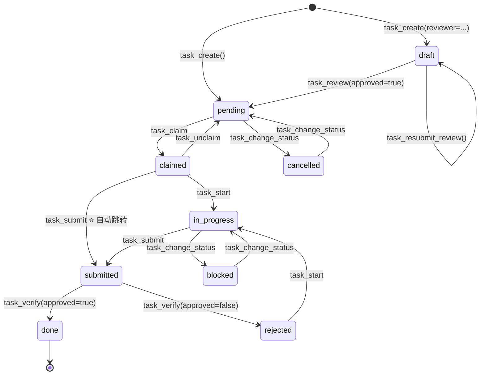

# CLI-Anything — MCP Server 接口文档

> **源文件**: `src/cli_anything/mcp_server/server.py`（~503 行）
> **框架**: [FastMCP](https://github.com/jlowin/fastmcp)
> **协议**: [Model Context Protocol (MCP)](https://modelcontextprotocol.io/)
> **传输**: stdio（当前唯一支持的传输方式）

---

## 目录

- [1. 模块概述](#1-模块概述)
- [2. 全局配置与初始化](#2-全局配置与初始化)
  - [2.1 全局变量](#21-全局变量)
  - [2.2 初始化函数 \_init\_mcp()](#22-初始化函数-_init_mcp)
  - [2.3 辅助访问函数](#23-辅助访问函数)
- [3. 工具详解（全部 26 个工具）](#3-工具详解全部-26-个工具)
  - [3.1 任务创建](#31-任务创建)
  - [3.2 查询](#32-查询)
  - [3.3 任务流转](#33-任务流转)
  - [3.4 审阅流程](#34-审阅流程)
  - [3.5 更新与删除](#35-更新与删除)
  - [3.6 日志](#36-日志)
  - [3.7 测试与健康](#37-测试与健康)
  - [3.8 Judgment Day](#38-judgment-day)
  - [3.9 任务依赖图（DAG）](#39-任务依赖图dag)
- [4. 返回格式规范](#4-返回格式规范)
- [5. task\_submit 特殊逻辑](#5-task_submit-特殊逻辑)
- [6. 状态枚举参考](#6-状态枚举参考)
- [7. MCP 工具与状态变更对照表](#7-mcp-工具与状态变更对照表)
  - [7.1 任务状态流转图（Mermaid）](#71-任务状态流转图mermaid)
  - [7.2 工具与状态变更对照](#72-工具与状态变更对照)
- [8. 设计要点](#8-设计要点)
- [9. 工具速查表](#9-工具速查表)
- [10. 典型使用场景](#10-典型使用场景)
  - [10.1 AI Agent 完整工作流（从创建到验收）](#101-ai-agent-完整工作流从创建到验收)
  - [10.2 带审阅的任务创建流程](#102-带审阅的任务创建流程)
  - [10.3 主任务拆解与进度跟踪](#103-主任务拆解与进度跟踪)

---

## 1. 模块概述

`server.py` 是 CLI-Anything 项目的 **AI Agent 访问层**，基于 FastMCP 框架实现 Model Context Protocol (MCP) 服务器。它为 AI Agent（如 Claude、GPT、Gemini 等）提供 **26 个标准化工具**，使 Agent 能够通过 MCP 协议直接操作任务系统。

核心职责：

| 职责 | 说明 |
|------|------|
| 工具注册 | 通过 `@mcp.tool()` 将 17 个 Python 函数注册为 MCP 工具 |
| 参数转换 | 将 MCP 协议传入的 JSON 参数映射为 TaskManager 方法调用 |
| 结果序列化 | 将 TaskManager 返回的模型对象转为 `dict` 返回给 Agent |
| 异常处理 | 捕获 `TaskManagerError`，统一返回 `{"success": false, "error": ...}` |
| 组件管理 | 延迟初始化并管理 Config / Database / TaskManager 单例 |

依赖关系：

```
mcp_server/server.py
├── core.models          (TaskStatus, TaskType, TestStatus, ReviewStatus)
├── core.task_manager    (TaskManager, TaskManagerError)
├── core.test_runner     (run_tests_simple — 仅 task_test 延迟导入)
├── core.health_checker  (TerminalHealthChecker — 仅 task_health 延迟导入)
├── storage.database     (Database)
└── utils.config         (Config)
```

MCP Server 与 CLI 命令行（`04-CLI命令行.md`）共享同一套核心层（TaskManager、Database），是任务系统的另一个访问入口：

```
AI Agent (Claude/GPT/Gemini)
        │
        │  MCP 协议 (stdio)
        ▼
  ┌─────────────┐
  │  MCP Server  │  ← FastMCP 框架
  │  (server.py) │
  └──────┬──────┘
         │
    ┌────▼────┐
    │TaskManager│  ← 核心业务逻辑（与 CLI 共享）
    └────┬────┘
         │
    ┌────▼────┐
    │ Database │  ← SQLite 存储
    └─────────┘
```

---

## 2. 全局配置与初始化

### 2.1 全局变量

```python
mcp = FastMCP("CLI-Anything", instructions="跨终端协同任务系统 MCP Server")

_db: Database | None = None       # Database 单例
_config: Config | None = None     # 全局配置（延迟加载）
_tm: TaskManager | None = None    # TaskManager 单例
```

| 变量 | 类型 | 说明 |
|------|------|------|
| `mcp` | `FastMCP` | FastMCP 服务器实例，名称 `"CLI-Anything"` |
| `_db` | `Database \| None` | 数据库单例，首次使用时初始化 |
| `_config` | `Config \| None` | 配置对象，延迟加载 |
| `_tm` | `TaskManager \| None` | TaskManager 单例，固定 `terminal_id="mcp-agent"` |

### 2.2 初始化函数 `_init_mcp()`

```python
def _init_mcp():
    global _db, _config, _tm
    if _db is not None:
        return                                        # 幂等：已初始化则跳过
    _config = Config()
    _config.load()                                    # 加载配置文件
    _db = Database(_config.get("database.path"))      # 根据配置路径创建 Database
    _db.connect()                                     # 连接数据库
    _tm = TaskManager(_db, terminal_id="mcp-agent")   # 固定终端 ID
```

**关键特性**：
- **延迟加载**：仅在第一个工具被调用时初始化，而非服务器启动时
- **幂等设计**：重复调用不会重复初始化（通过 `_db is not None` 守卫）
- **固定 terminal_id**：所有 MCP 工具操作统一以 `"mcp-agent"` 身份执行

### 2.3 辅助访问函数

| 函数 | 返回类型 | 说明 |
|------|----------|------|
| `_get_tm()` | `TaskManager` | 确保初始化后返回 TaskManager 实例 |
| `_get_db()` | `Database` | 确保初始化后返回 Database 实例 |

两个函数内部都调用 `_init_mcp()` 保证组件就绪，并通过 `assert` 确认非空。

---

## 3. 工具详解（全部 21 个工具）

### 3.1 任务创建

#### 1. `task_create` — 创建新任务

创建单个任务。如果指定 `reviewer`，任务将以 `draft` 状态创建并等待审阅。

**参数**：

| 参数 | 类型 | 必填 | 默认值 | 说明 |
|------|------|------|--------|------|
| `title` | `str` | ✅ | — | 任务标题 |
| `description` | `str` | ❌ | `""` | 任务描述 |
| `priority` | `int` | ❌ | `3` | 优先级 1-5（1 最高） |
| `tags` | `list[str] \| None` | ❌ | `None` | 标签列表 |
| `reviewer` | `str \| None` | ❌ | `None` | 审阅者终端 ID |

**返回格式**：

```json
// 成功（无审阅）
{
  "success": true,
  "task_id": "abc123",
  "title": "实现用户登录",
  "status": "pending"
}

// 成功（有审阅）
{
  "success": true,
  "task_id": "abc123",
  "title": "实现用户登录",
  "status": "draft",
  "reviewer": "terminal-1",
  "review_status": "pending_review"
}

// 失败
{
  "success": false,
  "error": "错误描述"
}
```

**使用示例**：

```json
// 创建普通任务
task_create(title="实现用户登录", priority=2, tags=["auth", "backend"])

// 创建需要审阅的任务
task_create(title="重构数据库层", description="...", reviewer="human-terminal")
```

---

#### 2. `task_decompose` — 将主任务拆解为子任务

将一个主任务拆解为多个子任务。子任务自动关联到父任务。

**参数**：

| 参数 | 类型 | 必填 | 默认值 | 说明 |
|------|------|------|--------|------|
| `parent_id` | `str` | ✅ | — | 父任务 ID |
| `subtasks` | `list[dict]` | ✅ | — | 子任务列表（见下方格式） |
| `reviewer` | `str \| None` | ❌ | `None` | 审阅者终端 ID |

**subtasks 列表项格式**：

```json
{
  "title": "子任务标题",          // 必填
  "description": "子任务描述",    // 可选
  "priority": 2,                   // 可选，默认继承
  "tags": ["tag1"]                 // 可选
}
```

**返回格式**：

```json
// 成功
{
  "success": true,
  "count": 3,
  "subtasks": [
    {"id": "sub-1", "title": "子任务1", "status": "pending"},
    {"id": "sub-2", "title": "子任务2", "status": "pending"},
    {"id": "sub-3", "title": "子任务3", "status": "pending"}
  ],
  "reviewer": "terminal-1"  // 仅在指定 reviewer 时出现
}

// 失败
{"success": false, "error": "父任务不存在"}
```

**使用示例**：

```json
task_decompose(
  parent_id="master-001",
  subtasks=[
    {"title": "设计数据库表结构", "priority": 1},
    {"title": "实现 CRUD 接口", "priority": 2},
    {"title": "编写单元测试", "priority": 3, "tags": ["test"]}
  ]
)
```

---

### 3.2 查询

#### 3. `task_list` — 列出任务

支持多维度过滤的任务列表查询。

**参数**：

| 参数 | 类型 | 必填 | 默认值 | 说明 |
|------|------|------|--------|------|
| `status` | `str \| None` | ❌ | `None` | 按状态过滤 |
| `task_type` | `str \| None` | ❌ | `None` | 按类型过滤（`master` / `subtask`） |
| `parent_id` | `str \| None` | ❌ | `None` | 按父任务 ID 过滤 |
| `tag` | `str \| None` | ❌ | `None` | 按标签过滤 |
| `limit` | `int` | ❌ | `50` | 返回数量限制 |

**status 可选值**：`pending`、`claimed`、`in_progress`、`submitted`、`done`、`rejected`、`blocked`、`cancelled`、`draft`

**返回格式**：

```json
{
  "count": 2,
  "tasks": [
    {
      "id": "task-001",
      "title": "实现用户登录",
      "status": "pending",
      "type": "subtask",
      "priority": 2,
      "tags": ["auth"],
      "parent_id": "master-001",
      "claimed_by": null,
      "test_status": "not_run"
    }
  ]
}
```

> **注意**：`task_list` 不返回 `success` 字段，始终返回 `count` + `tasks`。

**使用示例**：

```json
// 列出所有待领取的子任务
task_list(status="pending", task_type="subtask")

// 列出某主任务下的所有子任务
task_list(parent_id="master-001")

// 列出带特定标签的任务
task_list(tag="backend", limit=10)
```

---

#### 4. `task_show` — 查看任务完整详情

获取单个任务的全部字段信息。如果是主任务，还会自动附带子任务列表和进度统计。

**参数**：

| 参数 | 类型 | 必填 | 说明 |
|------|------|------|------|
| `task_id` | `str` | ✅ | 任务 ID |

**返回格式**：

```json
{
  "success": true,
  "task": {
    "id": "master-001",
    "title": "用户认证系统",
    "description": "实现完整的用户认证流程",
    "status": "in_progress",
    "type": "master",
    "priority": 1,
    "tags": ["auth"],
    "parent_id": null,
    "created_by": "mcp-agent",
    "claimed_by": "mcp-agent",
    "claimed_at": "2025-01-01T10:00:00",
    "submitted_at": null,
    "verified_by": null,
    "verified_at": null,
    "verify_comment": null,
    "test_status": "not_run",
    "test_report": null,
    "test_path": null,
    "work_dir": null,
    "created_at": "2025-01-01T09:00:00",
    "updated_at": "2025-01-01T10:00:00"
  },
  "subtasks": [
    {"id": "sub-1", "title": "设计表结构", "status": "done", "priority": 1},
    {"id": "sub-2", "title": "实现接口", "status": "in_progress", "priority": 2}
  ],
  "progress": {
    "total": 2,
    "done": 1,
    "in_progress": 1,
    "pending": 0,
    "percentage": 50.0
  }
}
```

> `subtasks` 和 `progress` 字段仅在任务有子任务时出现。

**错误返回**：

```json
{"success": false, "error": "任务 xyz 不存在"}
```

---

#### 5. `task_progress` — 查看主任务进度

获取主任务的子任务完成进度统计。

**参数**：

| 参数 | 类型 | 必填 | 说明 |
|------|------|------|------|
| `parent_id` | `str` | ✅ | 主任务 ID |

**返回格式**：

```json
{
  "success": true,
  "total": 5,
  "done": 2,
  "in_progress": 1,
  "pending": 2,
  "percentage": 40.0
}
```

**错误校验**：工具会先检查父任务是否存在，不存在则返回错误。

```json
{"success": false, "error": "任务 xyz 不存在"}
```

---

### 3.3 任务流转

#### 6. `task_claim` — 领取任务

将一个 `pending` 状态的任务领取为 `claimed`，由 `mcp-agent` 持有。

**参数**：

| 参数 | 类型 | 必填 | 说明 |
|------|------|------|------|
| `task_id` | `str` | ✅ | 任务 ID |

**返回格式**：

```json
{"success": true, "task_id": "task-001", "status": "claimed"}
```

**错误场景**：
- 任务不存在
- 任务非 `pending` 状态
- 任务已被其他终端领取

---

#### 7. `task_unclaim` — 释放任务

将已领取的任务释放回 `pending` 状态，取消占用。

**参数**：

| 参数 | 类型 | 必填 | 说明 |
|------|------|------|------|
| `task_id` | `str` | ✅ | 任务 ID |

**返回格式**：

```json
{"success": true, "task_id": "task-001", "status": "pending"}
```

---

#### 8. `task_start` — 开始工作

将 `claimed` 或 `rejected` 状态的任务转为 `in_progress`。

**参数**：

| 参数 | 类型 | 必填 | 说明 |
|------|------|------|------|
| `task_id` | `str` | ✅ | 任务 ID |

**合法前置状态**：`claimed`、`rejected`

**返回格式**：

```json
{"success": true, "task_id": "task-001", "status": "in_progress"}
```

---

#### 9. `task_submit` — 提交任务 ⭐

提交已完成的任务。**此工具含特殊自动跳转逻辑**，详见 [第 5 节](#5-task_submit-特殊逻辑)。

**参数**：

| 参数 | 类型 | 必填 | 说明 |
|------|------|------|------|
| `task_id` | `str` | ✅ | 任务 ID |

**返回格式**：

```json
{"success": true, "task_id": "task-001", "status": "submitted"}
```

**特殊行为**：如果任务当前为 `claimed` 状态，会自动先执行 `start`（→ `in_progress`），再执行 `submit`（→ `submitted`），无需 Agent 手动调用两步。

---

#### 10. `task_verify` — 验收任务

对 `submitted` 状态的任务进行验收。通过则变为 `done`，驳回则变为 `rejected`。

**参数**：

| 参数 | 类型 | 必填 | 默认值 | 说明 |
|------|------|------|--------|------|
| `task_id` | `str` | ✅ | — | 任务 ID |
| `approved` | `bool` | ✅ | — | `true` = 通过，`false` = 驳回 |
| `comment` | `str` | ❌ | `""` | 验收意见 |

**返回格式**：

```json
// 通过
{
  "success": true,
  "task_id": "task-001",
  "status": "done",
  "comment": "代码质量良好"
}

// 驳回
{
  "success": true,
  "task_id": "task-001",
  "status": "rejected",
  "comment": "缺少错误处理"
}
```

---

### 3.4 审阅流程

#### 11. `task_review` — 审阅任务定义

对 `draft` 状态的任务进行审阅。通过后任务进入 `pending`（可领取），驳回则留在 `draft`。

**参数**：

| 参数 | 类型 | 必填 | 默认值 | 说明 |
|------|------|------|--------|------|
| `task_id` | `str` | ✅ | — | 任务 ID |
| `approved` | `bool` | ✅ | — | `true` = 通过，`false` = 驳回 |
| `comment` | `str` | ❌ | `""` | 审阅意见 |

**返回格式**：

```json
// 审阅通过
{
  "success": true,
  "task_id": "task-001",
  "status": "pending",
  "review_status": "approved",
  "comment": "方案可行"
}

// 审阅驳回
{
  "success": true,
  "task_id": "task-001",
  "status": "draft",
  "review_status": "rejected",
  "comment": "需要补充测试计划"
}
```

---

#### 12. `task_resubmit_review` — 重新提交审阅

审阅被驳回后，修改任务内容后重新提交审阅。

**参数**：

| 参数 | 类型 | 必填 | 默认值 | 说明 |
|------|------|------|--------|------|
| `task_id` | `str` | ✅ | — | 任务 ID |
| `reviewer` | `str \| None` | ❌ | `None` | 新审阅者终端 ID（留空沿用原审阅者） |

**返回格式**：

```json
{
  "success": true,
  "task_id": "task-001",
  "reviewer": "human-terminal",
  "review_status": "pending_review"
}
```

---

### 3.5 更新与删除

#### 13. `task_update` — 更新任务属性

更新任务的可变属性。只需传入需要修改的字段，未传入的字段保持不变。

**参数**：

| 参数 | 类型 | 必填 | 默认值 | 说明 |
|------|------|------|--------|------|
| `task_id` | `str` | ✅ | — | 任务 ID |
| `title` | `str \| None` | ❌ | `None` | 新标题 |
| `description` | `str \| None` | ❌ | `None` | 新描述 |
| `priority` | `int \| None` | ❌ | `None` | 新优先级（1-5） |
| `tags` | `list[str] \| None` | ❌ | `None` | 新标签列表（替换而非追加） |
| `test_path` | `str \| None` | ❌ | `None` | 测试文件路径 |
| `work_dir` | `str \| None` | ❌ | `None` | 工作目录 |

**返回格式**：

```json
{"success": true, "task_id": "task-001"}
```

**使用示例**：

```json
// 设置测试路径（为后续 task_test 做准备）
task_update(task_id="task-001", test_path="tests/test_auth.py", work_dir="/project")

// 修改优先级和标签
task_update(task_id="task-001", priority=1, tags=["urgent", "auth"])
```

---

#### 14. `task_delete` — 删除任务

永久删除任务。

**参数**：

| 参数 | 类型 | 必填 | 说明 |
|------|------|------|------|
| `task_id` | `str` | ✅ | 任务 ID |

**返回格式**：

```json
// 成功
{"success": true, "task_id": "task-001"}

// 失败
{"success": false, "error": "任务 task-001 不存在或删除失败"}
```

> **注意**：`task_delete` 通过 `TaskManager.delete_task()` 的布尔返回值判断成功与否，而非异常捕获。

---

### 3.6 日志

#### 15. `task_log` — 查看操作日志

查看任务操作日志。可按任务 ID 过滤，也可查看全局日志。

**参数**：

| 参数 | 类型 | 必填 | 默认值 | 说明 |
|------|------|------|--------|------|
| `task_id` | `str \| None` | ❌ | `None` | 任务 ID（留空显示全部日志） |
| `limit` | `int` | ❌ | `30` | 返回条数 |

**返回格式**：

```json
{
  "count": 3,
  "logs": [
    {
      "timestamp": "2025-01-01T10:00:00",
      "task_id": "task-001",
      "action": "claim",
      "terminal_id": "mcp-agent",
      "detail": "任务被领取"
    },
    {
      "timestamp": "2025-01-01T10:05:00",
      "task_id": "task-001",
      "action": "start",
      "terminal_id": "mcp-agent",
      "detail": "开始工作"
    }
  ]
}
```

> **注意**：与 `task_list` 类似，`task_log` 不返回 `success` 字段，始终返回 `count` + `logs`。

---

### 3.7 测试与健康

#### 16. `task_test` — 运行任务关联的测试

运行任务关联的测试套件。需要提前通过 `task_update` 设置 `test_path`。

**参数**：

| 参数 | 类型 | 必填 | 默认值 | 说明 |
|------|------|------|--------|------|
| `task_id` | `str` | ✅ | — | 任务 ID |
| `timeout` | `int` | ❌ | `300` | 测试超时秒数 |

**前置条件**：
- 任务必须存在
- 任务的 `test_path` 必须已设置（否则返回明确错误提示）

**返回格式**：

```json
{
  "success": true,
  "task_id": "task-001",
  "test_status": "passed",
  "report": {
    "total": 15,
    "passed": 14,
    "failed": 1,
    "errors": 0,
    "skipped": 0,
    "duration": 3.45,
    "exit_code": 1
  },
  "details": "... 测试输出详情 ..."
}
```

**内部流程**：
1. 获取任务，检查 `test_path` 是否存在
2. 调用 `run_tests_simple()` 执行测试
3. 根据结果设置 `TestStatus.PASSED` 或 `TestStatus.FAILED`
4. 通过 `tm.update_test_result()` 将测试结果写入数据库
5. 返回结构化的测试报告

**错误场景**：

```json
{"success": false, "error": "任务未设置 test_path，请先用 task_update 设置"}
```

---

#### 17. `task_health` — 终端健康检查

检查终端健康状态，识别超时的终端。可选自动清理超时终端占用的任务。

**参数**：

| 参数 | 类型 | 必填 | 默认值 | 说明 |
|------|------|------|--------|------|
| `timeout` | `int` | ❌ | `60` | 终端超时阈值（秒） |
| `cleanup` | `bool` | ❌ | `false` | 是否自动释放超时终端占用的任务 |

**返回格式**：

```json
// 仅检查
{
  "success": true,
  "stale_count": 2,
  "stale_terminals": [
    {"id": "term-1", "name": "Terminal 1", "last_active": "2025-01-01T09:00:00"},
    {"id": "term-2", "name": "Terminal 2", "last_active": "2025-01-01T08:30:00"}
  ]
}

// 检查并清理
{
  "success": true,
  "stale_count": 2,
  "stale_terminals": [...],
  "released_tasks": ["task-001", "task-002"],
  "released_count": 2
}
```

> **注意**：`task_health` 直接使用 `_get_db()` 获取数据库实例，而非 `_get_tm()`，因为 `TerminalHealthChecker` 需要直接操作数据库。

---

#### 18. `task_judgment_day` — 触发双盲对抗审查

为 `submitted` 状态的任务创建两个独立审查任务（Judge A 和 Judge B），启动 Judgment Day 流程。

**参数**：

| 参数 | 类型 | 必填 | 说明 |
|------|------|------|------|
| `task_id` | `str` | ✅ | 被审查的任务 ID（必须是 submitted 状态） |

**返回格式**：

```json
{
  "success": true,
  "task_id": "task-001",
  "judge_a": {"id": "review-001", "title": "【Judgment Day R1】Judge A 审查 #task-001", "status": "pending"},
  "judge_b": {"id": "review-002", "title": "【Judgment Day R1】Judge B 审查 #task-001", "status": "pending"},
  "message": "双盲审查已启动，请由两个不同的 Worker 分别认领 judge_a 和 judge_b 任务"
}
```

**错误场景**：

```json
{"success": false, "error": "只能对 submitted 状态的任务发起 Judgment Day，当前状态: in_progress"}
{"success": false, "error": "已达到最大审查轮次（2 轮），建议人工介入处理或直接验收"}
```

---

#### 19. `task_submit_verdict` — 提交审查裁决

Worker 在认领并完成审查后，通过此工具提交裁决结果。

**参数**：

| 参数 | 类型 | 必填 | 默认值 | 说明 |
|------|------|------|--------|------|
| `review_task_id` | `str` | ✅ | — | 审查任务 ID（task_type = review） |
| `verdict` | `str` | ✅ | — | `"clean"`（无问题）或 `"issues"`（有问题） |
| `findings` | `list` | ❌ | `[]` | 发现的问题列表 |
| `summary` | `str` | ❌ | `""` | 一句话审查总结 |

`findings` 列表中每项格式：

```json
{
  "desc": "问题描述",
  "severity": "CRITICAL",   // CRITICAL / WARNING / SUGGESTION
  "location": "文件:行号"   // 可选
}
```

**返回格式**：

```json
{
  "success": true,
  "review_task_id": "review-001",
  "verdict": "issues",
  "findings_count": 2,
  "status": "submitted"
}
```

---

#### 20. `task_get_reviews` — 获取所有审查任务

获取某任务下的所有 REVIEW 类型任务，包含各轮次的 Judge A 和 Judge B。

**参数**：

| 参数 | 类型 | 必填 | 说明 |
|------|------|------|------|
| `task_id` | `str` | ✅ | 被审查的原始任务 ID |

**返回格式**：

```json
{
  "success": true,
  "task_id": "task-001",
  "count": 2,
  "reviews": [
    {
      "id": "review-001",
      "title": "【Judgment Day R1】Judge A 审查 #task-001",
      "status": "submitted",
      "tags": ["jd-judge-a", "jd-round-1"],
      "verdict": "issues"
    },
    {
      "id": "review-002",
      "title": "【Judgment Day R1】Judge B 审查 #task-001",
      "status": "submitted",
      "tags": ["jd-judge-b", "jd-round-1"],
      "verdict": "clean"
    }
  ]
}
```

---

#### 21. `task_synthesize` — 综合审查裁决

综合最新一轮双盲审查的两份裁决，生成对比分析报告，并给出 recommendation。

**参数**：

| 参数 | 类型 | 必填 | 说明 |
|------|------|------|------|
| `task_id` | `str` | ✅ | 被审查的原始任务 ID |

**返回格式**：

```json
{
  "success": true,
  "round": 1,
  "judge_a": {
    "task_id": "review-001",
    "verdict": "issues",
    "summary": "发现 1 个严重问题",
    "findings_count": 1
  },
  "judge_b": {
    "task_id": "review-002",
    "verdict": "issues",
    "summary": "发现 2 个问题",
    "findings_count": 2
  },
  "confirmed": [
    {"desc": "缺少 CSRF 防护", "severity": "CRITICAL", "location": "auth.py:88"}
  ],
  "suspect_a": [],
  "suspect_b": [
    {"desc": "日志记录过于详细泄露 token", "severity": "WARNING"}
  ],
  "both_clean": false,
  "recommendation": "fix"
}
```

**recommendation 值说明**：

| 值 | 含义 | 建议操作 |
|----|------|----------|
| `approve` | 双方均无问题 | 可直接调用 `task_verify(approved=true)` |
| `fix` | 第 1 轮有问题 | Worker 修复后重新提交，再触发第 2 轮 |
| `escalated` | 第 2 轮仍有问题 | 人工介入，直接 `task_verify` 做最终裁定 |

**错误场景**：

```json
{"success": false, "error": "该任务没有任何审查任务，请先调用 trigger_judgment_day"}
{"success": false, "error": "第 1 轮审查尚未完成，待提交的审查任务: ['review-002']"}
```

---

### 3.9 任务依赖图（DAG）

#### 22. `task_add_dep` — 添加前置依赖

声明 `task_id` 任务在 `depends_on` 完成（`done`）之前不能被领取。

**参数**：

| 参数 | 类型 | 必填 | 说明 |
|------|------|------|------|
| `task_id` | `str` | ✅ | 需要等待前置任务的任务 ID |
| `depends_on` | `str` | ✅ | 前置任务 ID |

**返回格式**：

```json
{"ok": true, "task_id": "sub-b", "depends_on": "sub-a", "message": "已添加依赖：sub-b 依赖 sub-a"}
```

**错误场景**：

```json
{"ok": false, "error": "添加依赖会形成循环：..."}
{"ok": false, "error": "任务不能依赖自身"}
```

---

#### 23. `task_remove_dep` — 移除前置依赖

移除 `task_id` 对 `depends_on` 的前置依赖关系。

**参数**：

| 参数 | 类型 | 必填 | 说明 |
|------|------|------|------|
| `task_id` | `str` | ✅ | 任务 ID |
| `depends_on` | `str` | ✅ | 要移除的前置任务 ID |

**返回格式**：

```json
{"ok": true, "task_id": "sub-b", "depends_on": "sub-a", "message": "已移除依赖：sub-b 不再依赖 sub-a"}
```

---

#### 24. `task_get_deps` — 查询任务依赖关系

获取任务的完整依赖关系：前置依赖、下游依赖、当前阻塞状态。

**参数**：

| 参数 | 类型 | 必填 | 说明 |
|------|------|------|------|
| `task_id` | `str` | ✅ | 任务 ID |

**返回格式**：

```json
{
  "task_id": "sub-b",
  "depends_on": [{"id": "sub-a", "title": "子任务A", "status": "done"}],
  "depended_by": [{"id": "sub-c", "title": "子任务C", "status": "pending"}],
  "blocking": [],
  "is_blocked": false
}
```

| 字段 | 说明 |
|------|------|
| `depends_on` | 前置任务列表（含标题和状态） |
| `depended_by` | 下游任务列表（依赖该任务的） |
| `blocking` | 当前阻塞该任务的前置任务 ID 列表 |
| `is_blocked` | 是否被阻塞（blocking 非空时为 `true`） |

> **注意**：`task_claim` 会自动检查依赖，若 `is_blocked = true` 则领取失败并提示具体阻塞任务。

---

#### 25. `task_route` — 为任务推荐候选终端

Supervisor 视角：根据任务 tags 与终端 capabilities 的交集，返回最适合处理该任务的 Worker 终端列表。

**参数**：

| 参数 | 类型 | 必填 | 说明 |
|------|------|------|------|
| `task_id` | `str` | ✅ | 任务 ID |

**返回格式**：

```json
{
  "ok": true,
  "candidates": [
    {"terminal_id": "w1", "name": "Worker1", "role": "worker", "matched_tags": ["python"], "capabilities": ["python", "backend"]}
  ]
}
```

> 任务无 tags 时返回所有活跃 Worker 终端（matched_tags 为空列表）。

---

#### 26. `task_suggest` — 为终端推荐候选任务

Worker 视角：根据终端 capabilities 与任务 tags 的交集过滤 pending 任务，按优先级排序。

**参数**：

| 参数 | 类型 | 必填 | 默认值 | 说明 |
|------|------|------|--------|------|
| `terminal_id` | `str` | ❌ | 当前 mcp-agent | 终端 ID |
| `limit` | `int` | ❌ | `10` | 最多返回条数 |

**返回格式**：

```json
{
  "ok": true,
  "tasks": [{"id": "...", "title": "...", "priority": 1, "tags": ["python"], ...}]
}
```

> capabilities 为空时返回全量 pending；有 capabilities 但无匹配 tag 时也 fallback 全量。

---

## 4. 返回格式规范

所有工具遵循统一的返回格式约定：

### 操作类工具（成功/失败明确的工具）

```json
// 成功
{"success": true, "task_id": "xxx", ...}

// 失败
{"success": false, "error": "错误描述字符串"}
```

### 查询类工具（始终返回数据）

| 工具 | 返回字段 | 说明 |
|------|----------|------|
| `task_list` | `count` + `tasks` | 不含 `success` 字段 |
| `task_log` | `count` + `logs` | 不含 `success` 字段 |

### 错误处理模式

| 模式 | 使用工具 | 说明 |
|------|----------|------|
| `try/except TaskManagerError` | 大多数工具 | 捕获业务异常，转为 `{"success": false, "error": ...}` |
| 手动检查 `task is None` | `task_show`、`task_submit`、`task_progress`、`task_test` | 先查询任务是否存在 |
| 布尔返回值判断 | `task_delete` | 通过 `delete_task()` 返回的布尔值判断 |
| 无错误处理 | `task_list`、`task_log` | 直接返回结果，不捕获异常 |

---

## 5. task_submit 特殊逻辑

`task_submit` 是唯一包含 **自动状态跳转** 逻辑的工具，专为 AI Agent 操作便利而设计。

### 标准流程 vs 快捷流程

```
标准流程（需要 3 步调用）:
  task_claim → task_start → task_submit

task_submit 快捷流程:
  如果当前状态为 claimed → 自动 start → 再 submit
  如果当前状态为 in_progress → 直接 submit
```

### 实现逻辑

```python
def task_submit(task_id: str) -> dict:
    task = tm.get_task(task_id)
    if not task:
        return {"success": False, "error": f"任务 {task_id} 不存在"}
    # 自动过渡：claimed → in_progress → submitted
    if task.status == TaskStatus.CLAIMED:
        tm.start_task(task_id)
    tm.submit_task(task_id)
    return {"success": True, "task_id": task_id, "status": "submitted"}
```

### 设计意图

AI Agent 在完成工作后可能忘记调用 `task_start`，直接调用 `task_submit`。此逻辑避免了 Agent 因状态不对而需要额外的错误处理和重试逻辑。

---

## 6. 状态枚举参考

### TaskStatus（任务状态）

| 枚举值 | 字符串 | 说明 |
|--------|--------|------|
| `DRAFT` | `"draft"` | 草稿，等待审阅 |
| `PENDING` | `"pending"` | 待领取 |
| `CLAIMED` | `"claimed"` | 已领取 |
| `IN_PROGRESS` | `"in_progress"` | 进行中 |
| `SUBMITTED` | `"submitted"` | 已提交，等待验收 |
| `DONE` | `"done"` | 已完成 |
| `REJECTED` | `"rejected"` | 被驳回 |
| `BLOCKED` | `"blocked"` | 被阻塞 |
| `CANCELLED` | `"cancelled"` | 已取消 |

### TaskType（任务类型）

| 枚举值 | 字符串 | 说明 |
|--------|--------|------|
| `MASTER` | `"master"` | 主任务 |
| `SUBTASK` | `"subtask"` | 子任务 |

### TestStatus（测试状态）

| 枚举值 | 字符串 | 说明 |
|--------|--------|------|
| `NOT_RUN` | `"not_run"` | 未运行 |
| `RUNNING` | `"running"` | 运行中 |
| `PASSED` | `"passed"` | 通过 |
| `FAILED` | `"failed"` | 失败 |

### ReviewStatus（审阅状态）

| 枚举值 | 字符串 | 说明 |
|--------|--------|------|
| `NOT_REQUIRED` | `"not_required"` | 无需审阅 |
| `PENDING` | `"pending_review"` | 待审阅 |
| `APPROVED` | `"approved"` | 已通过 |
| `REJECTED` | `"rejected"` | 已驳回 |

---

## 7. MCP 工具与状态变更对照表

### 7.1 任务状态流转图（Mermaid）



### 7.2 工具与状态变更对照

| MCP 工具 | 触发状态变更 | 前置状态 | 目标状态 |
|----------|-------------|----------|----------|
| `task_create` | 创建任务 | — | `pending` 或 `draft` |
| `task_create(reviewer=...)` | 创建并送审 | — | `draft` |
| `task_decompose` | 创建子任务 | — | `pending` 或 `draft` |
| `task_review(approved=true)` | 审阅通过 | `draft` | `pending` |
| `task_review(approved=false)` | 审阅驳回 | `draft` | `draft`（review_status→rejected） |
| `task_resubmit_review` | 重新送审 | `draft` | `draft`（review_status→pending_review） |
| `task_claim` | 领取 | `pending` | `claimed` |
| `task_unclaim` | 释放 | `claimed` | `pending` |
| `task_start` | 开始工作 | `claimed` / `rejected` | `in_progress` |
| `task_submit` | 提交成果 | `in_progress` | `submitted` |
| `task_submit` ⭐ | 自动跳转 | `claimed` | → `in_progress` → `submitted` |
| `task_verify(approved=true)` | 验收通过 | `submitted` | `done` |
| `task_verify(approved=false)` | 验收驳回 | `submitted` | `rejected` |
| `task_health(cleanup=true)` | 释放超时任务 | `claimed` | `pending` |

---

## 8. 设计要点

### 8.1 固定 terminal_id

```python
_tm = TaskManager(_db, terminal_id="mcp-agent")
```

所有通过 MCP Server 执行的操作统一使用 `"mcp-agent"` 作为终端 ID。这意味着：
- 无法区分不同 AI Agent（Claude vs GPT vs Gemini）的操作
- 日志中所有 MCP 操作的 `terminal_id` 均为 `"mcp-agent"`
- 如需区分，需在更上层（如 Agent prompt）中自行标注

### 8.2 Database 单例模式

通过 `_init_mcp()` 的幂等守卫确保整个 MCP Server 生命周期内只创建一个 `Database` 和 `TaskManager` 实例，避免重复连接数据库。

### 8.3 统一异常处理

绝大多数工具采用以下模式捕获异常：

```python
try:
    # 业务逻辑
    return {"success": True, ...}
except TaskManagerError as e:
    return {"success": False, "error": str(e)}
```

**例外**：`task_list` 和 `task_log` 未捕获异常（纯查询操作，预期不会抛出 `TaskManagerError`）。

### 8.4 配置延迟加载

配置和数据库连接在第一个工具被调用时才初始化，而非 MCP Server 启动时。这确保：
- 服务器可以快速启动
- 配置文件路径在运行时确定
- 数据库文件不会在不需要时被创建

### 8.5 传输方式

```python
def serve():
    _init_mcp()
    mcp.run()
```

当前仅支持 **stdio 传输**（FastMCP 默认）。`mcp.run()` 通过标准输入/输出与 AI Agent 通信。SSE（Server-Sent Events）传输虽然 FastMCP 框架支持，但本项目尚未实现相关配置。

---

## 9. 工具速查表

| # | 工具名 | 功能 | 关键参数 | 返回 success |
|---|--------|------|----------|:---:|
| 1 | `task_create` | 创建任务 | `title`*, description, priority, tags, reviewer | ✅ |
| 2 | `task_decompose` | 拆解子任务 | `parent_id`*, `subtasks`*, reviewer | ✅ |
| 3 | `task_list` | 列出任务 | status, task_type, parent_id, tag, limit | ❌ |
| 4 | `task_show` | 任务详情 | `task_id`* | ✅ |
| 5 | `task_progress` | 查看进度 | `parent_id`* | ✅ |
| 6 | `task_claim` | 领取任务 | `task_id`* | ✅ |
| 7 | `task_unclaim` | 释放任务 | `task_id`* | ✅ |
| 8 | `task_start` | 开始工作 | `task_id`* | ✅ |
| 9 | `task_submit` | 提交任务 ⭐ | `task_id`* | ✅ |
| 10 | `task_verify` | 验收任务 | `task_id`*, `approved`*, comment | ✅ |
| 11 | `task_review` | 审阅草稿 | `task_id`*, `approved`*, comment | ✅ |
| 12 | `task_resubmit_review` | 重新提交审阅 | `task_id`*, reviewer | ✅ |
| 13 | `task_update` | 更新属性 | `task_id`*, title, description, priority, tags, test_path, work_dir | ✅ |
| 14 | `task_delete` | 删除任务 | `task_id`* | ✅ |
| 15 | `task_log` | 操作日志 | task_id, limit | ❌ |
| 16 | `task_test` | 运行测试 | `task_id`*, timeout | ✅ |
| 17 | `task_health` | 健康检查 | timeout, cleanup | ✅ |
| 18 | `task_judgment_day` | 触发双盲审查 | `task_id`* | ✅ |
| 19 | `task_submit_verdict` | 提交审查裁决 | `review_task_id`*, `verdict`*, findings, summary | ✅ |
| 20 | `task_get_reviews` | 获取审查任务 | `task_id`* | ✅ |
| 21 | `task_synthesize` | 综合裁决报告 | `task_id`* | ✅ |
| 22 | `task_add_dep` | 添加前置依赖 | `task_id`*, `depends_on`* | ✅ |
| 23 | `task_remove_dep` | 移除前置依赖 | `task_id`*, `depends_on`* | ✅ |
| 24 | `task_get_deps` | 查询依赖关系 | `task_id`* | ✅ |
| 25 | `task_route` | 为任务推荐终端 | `task_id`* | ✅ |
| 26 | `task_suggest` | 为终端推荐任务 | `terminal_id`, `limit` | ✅ |

> `*` 表示必填参数；⭐ 表示含特殊逻辑

---

## 10. 典型使用场景

### 10.1 AI Agent 完整工作流（从创建到验收）

```
步骤 1: 创建主任务
  → task_create(title="实现用户认证系统", priority=1, tags=["auth"])
  ← {task_id: "master-001", status: "pending"}

步骤 2: 拆解子任务
  → task_decompose(parent_id="master-001", subtasks=[
      {title: "设计数据库表", priority: 1},
      {title: "实现登录接口", priority: 2},
      {title: "编写测试", priority: 3}
    ])
  ← {count: 3, subtasks: [...]}

步骤 3: 领取子任务
  → task_claim(task_id="sub-001")
  ← {status: "claimed"}

步骤 4: 完成工作后提交（自动跳转 claimed → in_progress → submitted）
  → task_submit(task_id="sub-001")
  ← {status: "submitted"}

步骤 5: 验收
  → task_verify(task_id="sub-001", approved=true, comment="代码质量良好")
  ← {status: "done"}

步骤 6: 查看整体进度
  → task_progress(parent_id="master-001")
  ← {total: 3, done: 1, percentage: 33.3}
```

### 10.2 带审阅的任务创建流程

```
步骤 1: 创建需要审阅的任务
  → task_create(title="重构数据库层", reviewer="human-terminal")
  ← {status: "draft", review_status: "pending_review"}

步骤 2: 人类终端审阅通过
  → task_review(task_id="task-001", approved=true, comment="方案可行")
  ← {status: "pending", review_status: "approved"}

步骤 2（或）: 审阅驳回
  → task_review(task_id="task-001", approved=false, comment="需要补充")
  ← {status: "draft", review_status: "rejected"}

步骤 3: 修改后重新提交审阅
  → task_update(task_id="task-001", description="补充了测试计划...")
  → task_resubmit_review(task_id="task-001")
  ← {review_status: "pending_review"}
```

### 10.3 主任务拆解与进度跟踪

```
步骤 1: 创建并拆解
  → task_create(title="API 重构")
  → task_decompose(parent_id="master-001", subtasks=[...])

步骤 2: 查看详情（含子任务和进度）
  → task_show(task_id="master-001")
  ← {task: {...}, subtasks: [...], progress: {total: 5, done: 2, percentage: 40}}

步骤 3: 列出待领取的子任务
  → task_list(status="pending", parent_id="master-001")
  ← {count: 3, tasks: [...]}

步骤 4: 设置测试路径并运行测试
  → task_update(task_id="sub-001", test_path="tests/test_api.py")
  → task_test(task_id="sub-001")
  ← {test_status: "passed", report: {total: 10, passed: 10, ...}}

步骤 5: 查看操作日志
  → task_log(task_id="sub-001", limit=10)
  ← {count: 5, logs: [...]}
```
